# 造物营产品需求文档（PRD）｜Skill标准版 V1.0

版本：V1.0.0｜文档状态：完整评审版｜资料核对日期：2026-10-01（北京时间）

本 PRD 采用 pm-master 路由至 pm-prd-writer 的标准结构，面向课程评审及产品、设计、研发、测试共同评审。产品定位为 AI 电商创意平台，本次交付范围聚焦 PC 工作台中的图片创作与质量闭环，同时说明全平台工具边界。文档中的验收要求是完成标准；“已有实现”只说明能力存在，不能替代真实测试或人工确认。

| 版本 | 日期 | 修订人 | 修订内容 |
| --- | --- | --- | --- |
| V1.0.0 | 2026-10-01 | 项目负责人；Codex 辅助整理 | 按 Skill 标准重建需求、AI 规则、评测与验收；结合当前代码和最新真实评测 |

**事实基线**：主产品代码提交 487a7006e357277fc08e345c4dcbf77cd6955011；最近已验证发布为 V14；真实评测批次 real-eval-20260930-v1。线上演示与本机评测是不同环境。本稿没有执行新一轮付费生成，没有写入人工评分或关闭 Badcase。

**当前结论**：核心图片创作链路已有实现，12 个真实场景已执行，保存 29 张成品；人工视觉评分 0/29、评估器正式人工复核 0/12、真实修复回归 0。产品尚不能据此宣布商用验收通过。全文以“已有实现／真实验证／待修复／规划”区分完成状态。

## 概述（为什么做）

### 产品概述及目标

#### 背景介绍

中小商家、店铺运营和电商设计师在新品上架、日常内容经营、活动投放时，需要把商品照片转化为可发布的图片、文案及后续内容。现有替代路径通常是整理商品资料、抠图、搭建场景、写文案、排版、导出，再因商品失真或文字不可读反复修改。

[假设 H01] 项目的价值假设是：把上述分散工作连接到一个可复用的任务流程，能减少重复整理与返工。已有代码、原型和真实生成样例能够证明流程可执行；尚未形成用户访谈、真实采用率或配对工时证据，不能把节省比例、转化增长或投入产出收益写成已验证事实。下一阶段需用真实用户任务补足价值证据，见 D01。

真实评测已暴露三类直接影响交付的问题：商品主体被裁切、用户禁止的元素仍出现在像素中、中文排版与局部对比度影响可读性。因此当前优先级是保证商品与约束正确、成品可取回、人工验收可信，再扩展内容品类。

#### 产品概述

造物营为电商创作人员提供以商品素材为起点的 AI 创意工作台。用户上传商品图、设置用途与约束，获得不同创意方向的成品，随后进行文字调整、下载、质量反馈与问题回归。长期覆盖图片、文案、图文页面和视频；本版本承诺的核心交付是图片创作。

#### 产品目标

| 目标 | 指标与口径 | 本版要求或基线 | 验证时点 |
| --- | --- | --- | --- |
| 交付符合商品与需求的可采用素材 | 事实、需求、交付三个硬门；视觉人工评分；返工量 | 硬门全部通过、四维各≥1且合计≥6/8、非重做且修改≤10分钟；当前人工未测 | 本批人工评审及质量修复回归 |
| 交付数量与状态真实可见 | 完整组数／接受的正向任务数 | 当前 9/10=90%；部分交付 1/10；不隐藏失败方向 | 每批评测、每个任务结束 |
| 防止重复付费与结果丢失 | 重复提交新增调用数；恢复新增生成数 | 相同幂等请求不得重复生成；满足恢复条件时仅取回与存储，新增生成=0 | E02、E03 专项验收 |
| 能追踪问题并确认修复 | 问题→版本→新证据→回归的关联完整性 | 5 条真实问题均 investigating；回归 0；关闭必须有证据 | 每条问题关闭前 |
| 判断产品是否创造持续用户价值 | 北极星：生产环境每周首次有效采用的逻辑任务数 | 按北京时间周一至周日，任务去重、当前版本合格且被人工采用；当前未测 | 内部验证后的小范围试用 |
| 评估试用质量和效率 | 首次可用率、有效采用单任务真实成本、配对人工工时 | [待确认 D02] 建议至少20个正向任务用于初步观察，首次可用率试用目标≥70%；这是产品建议，不能推断统计显著或课程要求 | 试用启动前确认，结束后记录 |

| 目标用户 | 期望结果 | 验证方式 |
| --- | --- | --- |
| 中小商家／店铺运营 | 用现有商品图得到可直接使用或少量修改的活动图片 | 完成任务、人工判定、修改分钟数与采用记录 |
| 电商设计师 | 比较不同方案，保留商品事实并快速调整文字和构图 | 三方向差异性评审；修改后版本及再验收 |
| 内容／营销运营 | 按用途复用素材，知道哪些内容已完成、失败或待验收 | 项目恢复、用途与状态核对、导出取回测试 |

#### 目标用户与任务场景

| 场景 | 用户输入 | 期望产出 | 本版边界 |
| --- | --- | --- | --- |
| 新品上架 | 商品图、明确文案与约束 | 商品主视觉、场景素材 | 图片流程可用；整套商详仍为框架 |
| 日常内容经营 | 已有项目素材与新创意方向 | 图片与标题文案 | 可调整、复用已有素材；商品笔记未实现完整生成 |
| 活动／投放创意 | 商品图、活动文案、比例与风格 | 1张或3张创意方向图 | 不自动承诺发布、投放、转化；动态素材为规划 |

### 名词说明

| 名词 | 定义 |
| --- | --- |
| 项目 project | 用户持有的一组素材、配置和历史结果；不同于单次生成任务 |
| 逻辑任务 taskId | 用户一次业务意图的稳定标识；重试产生新执行 job，统计仍按业务意图区分 |
| 执行任务 jobId | 一次确定输入、模型、规则和版本的执行记录 |
| 创意方向 concept | scene 场景、studio 棚拍、graphic 平面等独立方案；本版每个方向独立调用生成 |
| 成品 asset | 可读取的最终文件，包含方向、尺寸、版本和校验结果 |
| 完整／部分交付 | 实际保存数量等于请求数量／大于0但少于请求数量；不能仅由技术任务状态判断 |
| 自动校验 | 文件存在、可读、尺寸、文本契约等确定性检查；不等于视觉质量判断 |
| 产品人工评审 | 人工对照原图与成品，检查商品、需求、视觉和修改量，决定是否采用 |
| 评估器人工复核 | 人工检查 AI 评分是否有依据；不自动变成产品采用或问题关闭 |
| Badcase／回归 | 有证据的不符合要求案例／用同条件的新执行或新成品版本检验修复 |
| 恢复 recover | 取回已生成结果并补存储，不重新生成；不同于付费重试 retry |
| production／evaluation | 真实生产业务／独立评测环境；legacy、mock 等历史或模拟数据不得混入生产指标 |

### 角色及权限

| 角色 | 用户可观察的权限 | 数据范围 | 状态 |
| --- | --- | --- | --- |
| 账户拥有者／创作者 | 上传、生成、查看、编辑、导出、反馈、管理自己的项目 | 仅本人账户拥有的数据 | 已有实现 |
| 产品评审者 | 对照图片、填写质量、采用／撤销、登记问题 | 当前仍基于账户所有权；可由同一人承担此职责 | 业务职责已定义，独立团队权限未实现 |
| 维护者 | 配置供应商、额度，诊断执行与修复，管理内部评测 | 通过现有维护配置与内部环境 | 不等于已上线管理后台或跨账户浏览 |
| 评估器复核者 | 在评测工具查看原始评分、保存复核与历史 | 工具账户有权访问的任务与限定证据目录 | 复核能力已实现；真实复核记录为0 |

跨账户访问资源应返回无权限或不存在，不泄露图片与元数据。[待确认 D06] 本版按单账户所有权交付；团队 RBAC、审批流和跨成员授权后续另行设计，不默认放开。

### 文档阅读对象

| 对象 | 本次阅读任务 | 重点入口 |
| --- | --- | --- |
| 课程评审教师 | 理解产品、真实执行、归因复盘和证据缺口 | 概述；评测基线；Badcase；作业证据 |
| 产品／设计 | 判断范围、交互、AI约束、质量标准与后续顺序 | 产品描述；F01–F14；待确认项 |
| 研发 | 明确行为、边界、版本与数据约束 | 功能需求；数据库；接口与系统集成 |
| 测试 | 按可观察结果验证，保留证据并避免重复生成 | 异常流程；TC01–TC32；E01–E08 |
| 运营／项目负责人 | 判断真实采用、成本、试用与交付状态 | 指标口径；评测与版本规划 |

## 产品描述（做什么）

### 产品需求描述

本版围绕“上传商品→配置创意→生成多方向→查看与修改→取回成品→人工验收→问题回归”建立闭环。以 PC Web 为交付端；移动端、证件照、AI图标已移出当前入口。本版核心输入是一张商品图片，不要求先填完整事实卡，也不承诺解析商品链接、网页、视频或批量 SKU。

平台六类工具、十二个入口中，五个标记可用、七个为框架。图片主流程本批已有真实执行；其余可用入口不能仅因界面存在就声称都完成了同等强度的评测。

| 类别 | 工具／代码标识 | 当前范围 | 完成状态 |
| --- | --- | --- | --- |
| 图像创作 | 图片创作 poster | 1/3方向创意图；本稿核心流程 | 已有实现，真实评测有待修复问题 |
| 商品图像 | 商品场景图 scene | 商品场景创作入口 | 标记可用；本批主要验证共用图片链路 |
| 文案创作 | 标题文案 copy | 基于确认事实给候选文案 | 标记可用；专项人工质量待补 |
| 图片加工 | 尺寸适配 resize | 图片规格加工 | 标记可用；专项导出与裁切验收待补 |
| 图片加工 | 智能抠图 cutout | 浏览器预处理、透明素材 | 标记可用；透明、多主体边界待补 |
| 图文创作 | 商品笔记 note | 保存需求、显示示意 | 框架 |
| 图文创作 | 商详长图 detail | 保存需求、显示示意 | 框架 |
| 图像创作 | 创意卡片 card | 保存需求、显示示意 | 框架 |
| 文案创作 | 导购文案 guide | 保存需求、显示示意 | 框架 |
| 视频创作 | 图生视频 video | 保存需求、显示示意 | 框架 |
| 视频创作 | 即刻成片 film | 保存需求、显示示意 | 框架 |
| 图像创作 | 创意字 font | 保存需求、显示示意 | 框架 |

**本版不承诺的结果**：完成全部十二工具、自动商业事实确认、自动视觉放行、自动发布电商平台、独立后台队列、团队审批、企业级 SLA、已验证 ROI。框架页面的示意图不能计为真实成品、调用成本或人工采用。

### 产品整体流程

#### 主流程

1. 选择图片创作并进入本人项目；上传原图，完成可重试的素材预处理。
2. 设置方向数量、品类、比例及背景、文案、布局等约束；在执行前冻结输入与版本。
3. 分析商品和场景，形成独立方向计划；分别生成并保存结果，再完成最终合成与校验。
4. 明确显示完整或部分交付；用户比较方案、调整文字、保存新版本并下载。
5. 人工检查商品、需求、视觉和修改量；通过后才记录采用；不合格进入问题定位与回归。

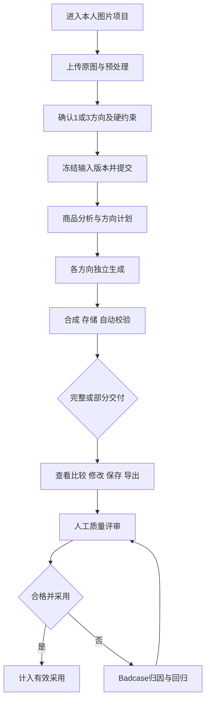

#### 失败、恢复与重试子流程

已有成功方向要保留，不用失败方向覆盖。若供应商已生成但下载或存储失败，先确认原结果与调用状态；满足条件时恢复原文件。用户明确选择重试后才创建新的付费执行，建立父子关系，不能无限自动重试。

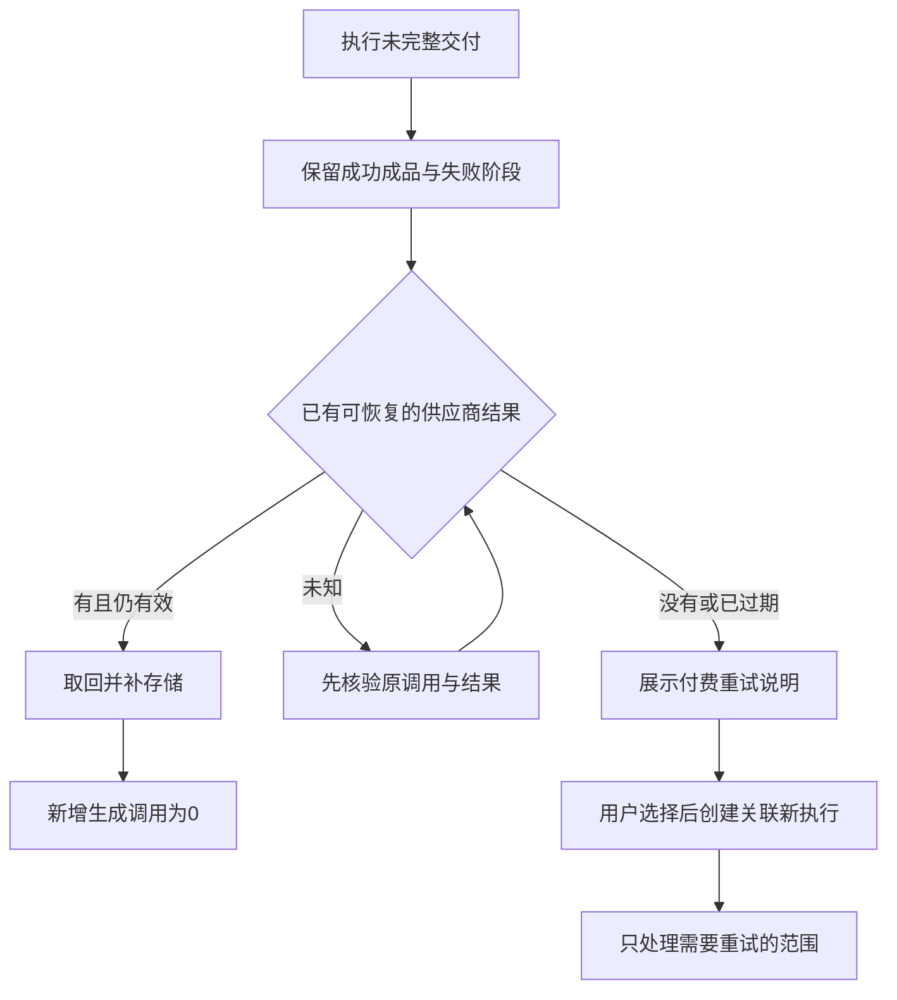

#### 数据流图（DFD）

图片、业务配置、执行日志、质量反馈分别存储并关联版本。生成供应商不是商品事实的权威来源；评估器只对明确送达的证据评分。

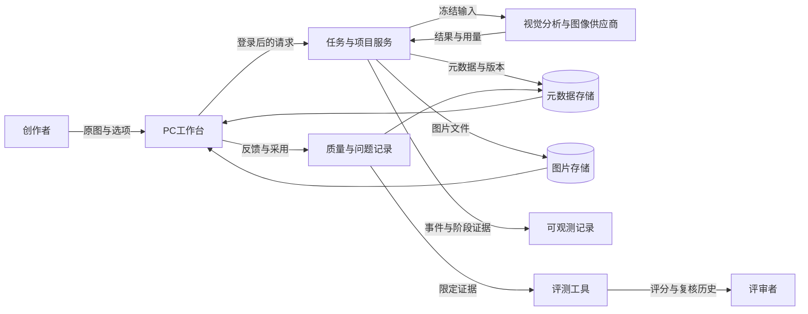

#### 状态转换图（STD）

技术执行与业务交付分开表示。技术状态 succeeded 可能只保存2/3张；当前记录这种情况存在，用户必须看到“部分交付”。成品修改后，旧版本的合格与采用结论不能直接沿用。

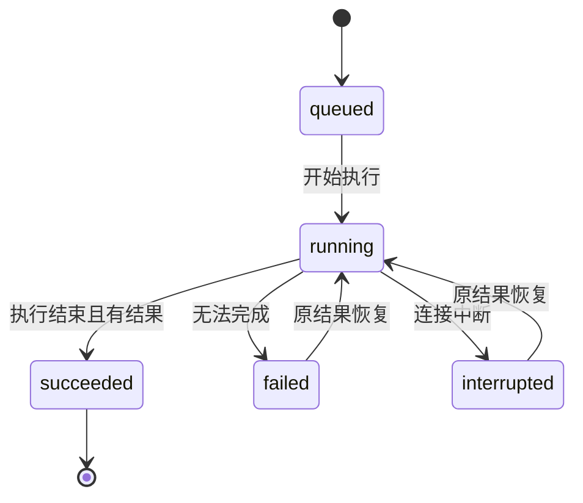

| 对象 | 状态或判定 | 转换条件 |
| --- | --- | --- |
| 执行 | queued／running／succeeded／failed／interrupted | 按阶段结果记录；客户端中断有独立状态 |
| 业务交付 | 完整／部分／无成品 | 实际可取回的已保存成品数与请求数量比较 |
| 成品质量 | 未评审／合格／不合格／已采用 | 当前 assetVersion 的自动与人工证据共同决定 |
| 成品修改 | 旧版本→新版本 | 修改文字或合成结果后增加版本；旧评审保留为历史 |
| Badcase | open→investigating→closed | 证据定位后进入调查；满足回归门才关闭 |

### 全局说明

#### 全局异常处理

以下文案是需求建议文案，若现有界面不同，以提示必须准确表达原因、可执行下一步和付费影响为验收标准。

| 场景／错误 | 处理行为 | 建议提示 |
| --- | --- | --- |
| 未登录／跨账户访问 | 拒绝写入或读取；不暴露其他账户信息 | 请登录后操作／内容不存在或无权访问 |
| 缺图、格式不符、选项不合法 | 提交前提示；服务端仍拒绝；不得调用模型 | 请上传商品图片／请检查创作设置 |
| 输入过大 413 | 保留其他设置，允许替换图片 | 图片超过大小限制，请压缩或更换 |
| 版本冲突 409 | 不静默覆盖，读取最新并保留冲突副本 | 内容已更新，请核对后保存 |
| 额度／并发限制 429 | 展示限制原因和当前可执行动作 | 当前生成额度或执行数量已达上限 |
| 上游不可用／网络／超时 | 保留证据和已成功方向，区分恢复与重试 | 此方向生成失败，已保留其他结果 |
| 已生成但未保存 | 标记未完成交付，先尝试恢复 | 结果尚未保存，可尝试取回原结果 |
| 结果状态不确定 | 不自动再付费；核验原任务 | 结果待确认，请先检查原执行 |
| 空项目、空质量列表 | 显示清楚的下一步或无记录原因 | 上传商品图开始创作／该环境暂无评审 |

所有联网功能的失败与无权限分支遵循本表。非法 ID、失效资源或数据缺失不能被包装为成功；断网时保留本地编辑和待同步状态，云端成功必须有服务端确认。

#### 普通列表规则

| 列表 | 当前范围 | 需求与统计限制 |
| --- | --- | --- |
| 工作台项目 | 服务端最多返回100个活跃项目；本地缓存辅助恢复 | 不把返回数量解释成完整历史；软删除记录单独处理 |
| 最近任务 | 当前界面最近60条 | 默认最近在前；环境明确；全量分析另做数据查询 |
| Badcase | 当前读取最多200条 | 展示严重度、状态、关联任务、版本；不得因此宣称全部历史问题已统计 |
| 评测工具结果 | 对当前评估任务筛选、复核及导出 | 原始评分与人工复核独立；导出包含筛选范围与复核历史 |

新增分页、搜索和更大规模检索应根据实际容量设计，当前不套用“每页20条”或默认拥有批量后台能力。

#### 全局交互

- 提交过程禁用重复按钮，并通过服务端幂等兜底；只依赖按钮禁用不足以验收。
- 进度展示分析、生成、合成、保存等实际阶段，不用虚假百分比覆盖失败。
- 删除为软删除，可撤销或恢复；冲突与恢复动作说明影响的对象和版本。
- 结果实际加载成功且可见后才记录查看事件；展示错误图、请求下载或点击采用分别记录，不混为一个成功事件。
- 框架工具明确展示示意与待实现状态，不能显示“真实生成成功”。
- [待确认 D05] PC 浏览器验收建议覆盖 Chrome、Edge 当前稳定版，1920×1080及1366×768；关键表单标签、键盘焦点和错误文本可读。尚未完成全量兼容实测。

### 产品版本规划（里程碑）

| 里程碑 | 范围与退出条件 | 依赖 | 状态／时间 |
| --- | --- | --- | --- |
| 当前 V14／版本A基线 | 保留当前代码、冻结输入和真实结果 | 已有演示与本机证据 | 最近已验证发布；本批执行完成 |
| M1 质量修复与人工验收 | 优先修复BC02、BC03；完成29张人工评审与12条评分复核；生成真实回归记录 | 现有图片、项目负责人评审；付费重试预算 | 待执行；不虚构截止日 |
| M2 可靠交付与试用准备 | E01–E04通过；线上质量与追踪配置核验；额度、数据保留、试用目标确认 | 云端环境、恢复故障演练、配置 | 待执行 |
| M3 品类与价值验证 | E05–E08；多主体及电子、服装、家居；配对工时与真实账单 | 品类素材、参与者、预算 | 规划 |
| 后续内容平台 | 按真实需求逐个扩展笔记、长图、导购、视频等 | 图片核心质量稳定、独立PRD与验收 | 规划；七个框架不在本版交付承诺中 |

上述顺序依据当前真实质量问题，不表示所有里程碑已得到资源或日期批准。

### 产品框架

平台入口承接用途选择，项目工作台保存商品与配置；图片创作调用分析与生成，素材加工负责抠图、尺寸及文字合成；质量中心承接成品评审、采用与问题回归；评测工具和追踪记录为内部证据系统。前台用户不需要理解供应商接口或数据库实现即可完成任务。

| 业务需求 | 当前承接模块 | 边界 |
| --- | --- | --- |
| R01 商品资料复用 | 项目、图片与历史配置 | 单项目可复用；未实现批量SKU编排 |
| R02 任务化入口 | 十二工具入口、PC工作台 | 可用工具与框架清楚区分 |
| R03 商品与场景 | 图片创作、商品场景 | 商品保真与像素硬约束仍有待修复案例 |
| R04 多用途文案 | 标题文案及图片文字 | 基于确认事实；不自动虚构商业属性 |
| R05 完整图文页面 | 商详／笔记框架 | 完整生成与页面编排待实现 |
| R06 商品动态 | 两个视频框架 | 不声称已生成真实视频 |
| R07 加工规格 | 抠图、尺寸与合成 | 导出与主体完整性待专项验收 |
| R08 修改整理 | 项目、版本、冲突与备份 | 修改后质量结论需重新确认 |
| R09 状态消耗 | 任务进度、调用用量、质量列表 | 调用配额不等于现金预算；采用和成本未测 |

### 功能清单

优先级：P0直接影响商品正确、权限、付费与交付；P1影响效率和评审闭环；P2为后续扩展。本表“待验收”不等于尚未编写代码。

| ID | 功能 | 优先级 | 版本范围 | 状态与对应验收 |
| --- | --- | --- | --- | --- |
| F01 | 项目与素材输入 | P0 | 本版 | 已有实现；TC01–03 |
| F02 | 创作配置和输入冻结 | P0 | 本版 | 已有实现；TC04–07 |
| F03 | 商品分析、事实和方向计划 | P0 | 本版 | 已有实现；TC08–10 |
| F04 | 独立方向生成、合成与校验 | P0 | 本版 | 29张真实保存；像素与裁切待修复；TC11–13 |
| F05 | 幂等、额度、失败恢复与重试 | P0 | 本版 | 已有实现；E02/E03正式故障验收待补；TC14–17 |
| F06 | 查看、修改、导出与项目恢复 | P0 | 本版 | 已有实现；实际下载取回待正式记录；TC18–21 |
| F07 | 产品人工评分与采用 | P0 | 本版 | 已有实现，人工0/29；TC22–23 |
| F08 | 组差异性评审 | P1 | 本版 | 已有实现；三方向人工待评；TC24 |
| F09 | Badcase与真实回归 | P0 | 本版 | 5条调查中，回归0；TC25–26 |
| F10 | 评测执行、非视觉评分与人工复核 | P1 | 本版内部工具 | 12条评分已跑；正式复核0；TC27–28 |
| F11 | 指标、环境隔离与追踪 | P1 | 本版 | 历史追踪回填已核对；自动导出与采用边界待验收；TC29–30 |
| F12 | 标题文案与图片加工入口 | P1 | 本版已有能力 | 标记可用，专项质量待补；TC31 |
| F13 | 框架工具需求保存 | P2 | 本版框架 | 仅需求保存与示意；TC32 |
| F14 | 团队权限及后续内容编排 | P2 | 后续 | 规划；不以当前入口存在判定完成 |

## 功能需求（怎么做）

### 项目、素材与创作设置（F01、F02）

#### 描述与用户故事

用户在自己的项目中上传商品图，明确生成数量、尺寸、背景和文案策略；系统在计费执行前验证输入并冻结版本。

作为店铺运营，我希望复用原图并明确约束，以便后续方案不因隐含默认值偏离需求。

#### 前置条件

| 类型 | 条件 |
| --- | --- |
| 权限 | 用户有权访问本项目；云端写入需登录 |
| 数据 | 准备PNG/JPG/WebP图片；输入可解码 |
| 功能 | 本地缓存可用；调用模型时另需平台AI配置与额度 |

#### 后置条件

原图保留，预处理结果可追溯；草稿配置保存。提交后形成确定的 inputRevision、规则／模型版本与 inputFingerprint，后续编辑不静默改变在执行的任务。

#### 界面及交互

| 元素 | 类型 | 必填／默认 | 校验规则 | 反馈 |
| --- | --- | --- | --- | --- |
| 商品图 | 文件上传 | 必填／空 | PNG、JPG、WebP；前台≤8MB；服务端验证解码及内部限制 | 缺图、过大、损坏时不调用模型 |
| 预处理 | 图片预览与动作 | 根据原图决定 | 浏览器抠图模型首用需下载约16MB；透明图可绕过 | 失败支持重试或采用原图；保持原图 |
| 方向数量 conceptCount | 单选 | 3 | 仅1或3 | 1方向自动模式当前取scene；不表示选择了最优方案 |
| 品类 category | 选择 | auto | auto、food、electronics、apparel、home、general | 自动品类不确定时回到general |
| 方向 direction | 选择 | auto | 仅使用当前服务端支持的方向枚举 | 不识别的值拒绝，不猜测 |
| 比例 ratio | 单选 | square | square=1:1、portrait=3:4 | 最终1080×1080或1080×1440 |
| 自定义背景 | 开关＋文本 | 关闭／空 | 开启后提示词≤500 Unicode码点 | 约束随任务冻结 |
| 自定义文案 | 开关 | 关闭 | 关闭=生成通用视觉标题；开启=使用输入文字 | 开启且空文字表示不叠加额外文字 |
| 标题／副标题 | 文本 | 条件必填／空 | 标题≤18码点、副标题≤40码点；服务端按原字符串计数后再trim | 超长报错；不自动截断后执行 |
| 自定义布局 | 开关＋选择 | 关闭／center | 手动center或right；自动布局可用left | 无效值拒绝 |
| 开始创作 | 按钮 | 根据校验可用 | 重复提交受幂等保护 | 显示执行阶段，阻止重复付费 |

服务端内部图片保护为解码后12MB、编码输入16MB、请求体24MB，不是前台允许上传12MB的承诺。标题含emoji等字符时，前台maxlength按UTF-16、服务端按Unicode码点可能出现差异；统一计数与提示列为验收项TC06。

#### 业务流程

#### 异常／分支流程

| 触发条件 | 处理与提示 |
| --- | --- |
| 图片不合法、缺图、超限 | 保留文字配置，替换图片；400/413；新增模型调用=0 |
| 抠图失败或透明／多主体边界 | 可重试或选择原图；不以抠图成功代替商品完整检查 |
| 连接断开或同步失败 | 保留本地草稿，标记待同步；联网后核对版本 |
| 无权限、资源已删、项目版本变化 | 按全局异常拒绝；不覆盖云端最新记录 |
| 用户在生成时更改设置 | 当前执行继续使用冻结值，新值应用于下一次提交 |

#### 数据字典

| 字段 | 类型 | 必填 | 说明 | 示例 |
| --- | --- | --- | --- | --- |
| projectId／ownerId | string | 是 | 本项目及账户标识 | proj_…／user_… |
| inputRevision | integer | 提交时是 | 原图和配置的输入版本 | 3 |
| sourceImage／preparedImage | asset reference | 原图是 | 原图与可选预处理文件 | input.png／prepared.png |
| conceptCount／ratio | enum | 是 | 数量和最终比例 | 3／portrait |
| category／direction | enum | 是 | 显式配置或auto | food／auto |
| customBackground／backgroundPrompt | boolean／string | 开启时文本有效 | 自定义背景策略与文字 | true／禁止新增水果 |
| customCopy／title／subtitle | boolean／string | 是／条件 | 文案策略；空文案可为明确选择 | true／周末好物／空 |
| customLayout／layout | boolean／enum | 是 | 手动与自动布局策略 | false／center |

### AI分析、生成与成品规则（F03、F04）

#### 描述与用户故事

系统依据原图、确认信息与用户约束制定独立创意方向，分别生成并合成成品。每个方向应在商品事实正确的前提下体现可比较的创意差异。

作为电商设计师，我希望得到商品可信、约束一致而方向不同的方案，以便选择并减少重做。

#### 前置条件

| 类型 | 条件 |
| --- | --- |
| 输入 | F01/F02验证通过，输入版本冻结 |
| 权限／外部 | 本人账户可生成，供应商已配置且可用 |
| 额度 | 账户剩余额度支持本次请求；与F05共用配额规则 |

#### 后置条件

记录分析、计划、每方向执行和实际结果；成品含可读文件、方向与版本，保存自动检查。显示完整、部分或无成品。AI输出不自动写成人工通过或采用。

#### 界面及交互与AI规则

| 规则ID | 规则与可观察要求 | 当前状态 |
| --- | --- | --- |
| AI01 约束优先级 | 原图与确认事实、用户硬约束优先于通用配方和模型建议；冲突不得用创意理由覆盖商品事实 | 输入与计划已有；像素约束仍有BC03 |
| AI02 商品保真 | 保留可见主体数量、包装形态、核心标识；看不清的细节不宣称识别为事实 | 人工及多主体专项待验收 |
| AI03 事实约束 | 不编造品牌、规格、价格、认证、功效或促销；自动文案以视觉描述为限；商业事实要有来源 | 规则已有；C08/C09评分依据争议待复核 |
| AI04 自动品类 | 分析置信度≥0.7时使用识别品类，否则general；类别置信度不是商品事实证明 | 已有实现 |
| AI05 独立方向 | 默认3方向scene/studio/graphic，分别生成；至少两个实质差异维度，不能只换文字或颜色 | 三方向执行已有；人工差异评审待补 |
| AI06 自定义文字 | 自定义开启时准确保留输入；开启且空时不叠加新文字；原包装印刷文字无需删除 | 已有实现；C11非视觉边界验证 |
| AI07 工作流区分 | reference_scene_edit返回已包含商品的图片，不能再次叠加抠图；历史locked_product_composite才按锁定主体合成 | 已有实现；按任务workflow追溯 |
| AI08 解析失败 | 分析JSON无效时按安全兜底处理；无效方向计划要明确失败，不能虚构完成 | 已有实现；需边界记录 |
| AI09 尺寸和主体完整 | 请求比例、供应商实际比例及最终比例均需记录；主体不得因cover裁切缺损 | BC02待修复：现有仅保证最终画布尺寸 |
| AI10 像素硬约束 | 将“禁止新增水果”等要求带入计划，并在成品层确认；文本包含约束不算像素验收 | BC03待修复 |
| AI11 中文排版 | 避免行首逗号、孤立尾行、超出安全区域与遮挡商品；修正时优先复用底图 | BC04待修复 |
| AI12 局部对比 | 标题在自身覆盖区域清晰可读；不能仅用全图平均亮度决定文字颜色 | BC05待修复 |

当前分析模型在本批为qwen3-vl-plus。生成模型、供应商、提示词版本和配方版本按执行记录冻结，不能把一次配置当作所有历史任务的默认值。食品配方可能干扰“禁止水果”等约束是当前待验证归因假设，不能写成已确认根因。

| 界面元素 | 默认／约束 | 用户反馈 |
| --- | --- | --- |
| 方向卡片 | 请求1或3；每方向独立状态 | 显示方向意图、进度或失败原因 |
| 成品预览 | 实际文件加载成功才展示完成 | 缺文件明确错误，保留其他已保存图 |
| 品类与计划说明 | 只展示能帮助选择的信息 | 不向普通用户堆砌模型参数或内部日志 |
| 部分交付提示 | 显示实际／请求数量 | 明确例如“已保存2张，1个方向失败” |

#### 业务流程

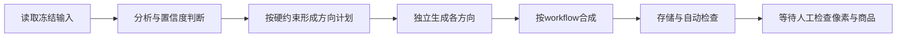

#### 异常／分支流程

| 场景 | 处理 |
| --- | --- |
| 上游不可用或某方向失败 | 成功方向留存，失败方向单独显示；通过F05恢复或经用户选择后重试 |
| 分析无效、品类低置信度 | 使用安全通用规则；无法形成有效计划时失败；不填造商业事实 |
| 返回图片比例异常 | 记录实际尺寸；[待修复] 自动阻止破坏主体的合成或要求人工处理 |
| 文字契约通过但图片仍违约 | 自动结果与视觉结论分别保存；不得因非视觉评分高而放行 |
| 存储失败、无权限或文件损坏 | 显示未交付并记录阶段；按全局规则拒绝访问，不展示虚构预览 |

#### 数据字典

| 字段 | 类型 | 必填 | 说明 | 示例 |
| --- | --- | --- | --- | --- |
| workflow | enum | 是 | 商品合成方式 | reference_scene_edit |
| analysisModel／generationModel | string | 是 | 本执行冻结的模型 | qwen3-vl-plus／执行记录值 |
| promptVersion／ruleVersion | string | 是 | 提示词与配方版本 | 当前任务记录值 |
| categoryConfidence | number | 有自动识别时 | 品类置信度，非事实置信度 | 0.82 |
| concepts | array | 是 | 各方向意图、背景、文案、布局与约束 | scene、studio、graphic |
| assetId／assetVersion | string／integer | 成品时是 | 成品及不可混用的版本 | asset_…／2 |
| rawWidth／rawHeight | integer | 取回后是 | 供应商返回尺寸 | 1491／1055 |
| finalWidth／finalHeight | integer | 成品时是 | 最终画布 | 1080／1440 |
| ruleCheck | object | 成品时是 | 文件与文本自动检查及版本 | readable=true |

### 执行、额度、恢复与重试（F05）

#### 描述与用户故事

系统保护用户的重复操作、剩余额度和已生成成果；在失败时区分“取回原结果”与“发起新生成”。

作为商家，我希望明确看到失败发生在哪一步、是否会再次收费，以便安全取回或重试。

#### 前置条件

| 类型 | 条件 |
| --- | --- |
| 配置 | 平台AI默认关闭、默认额度0；维护者需配置有效供应商与授权额度 |
| 权限 | 创建、恢复、重试均校验任务所有者 |
| 任务 | 恢复需要已有失败／中断任务及可取回结果；重试需要明确新意图和父任务关联 |

#### 后置条件

每个操作有幂等和版本结果；调用次数、实际用量、父任务、执行次数及失败原因保留。恢复成功仍按原逻辑任务计算；新生成成本不因为任务失败而消失。

#### 界面及交互

| 元素 | 默认／规则 | 可观察结果 |
| --- | --- | --- |
| 执行状态 | queued/running等真实阶段 | 浏览器需保持连接；不承诺关页后后台持续执行 |
| 额度提示 | 按账户UTC自然日统计调用额度；1/3方向预留对应生成尝试 | 配额与现金预算分开；分析用量另行记录 |
| 同时执行 | 当前账户最多2个queued/running任务；核心页面聚焦1个活动任务 | 超限拒绝，不新增模型调用 |
| 恢复 | 失败／中断、存在待恢复Qwen结果地址且未过24小时，并仍有效 | 只下载和补存储，新增生成=0；URL可能更早过期 |
| 重试 | 先说明范围及新调用 | 用户选择后新建关联执行；不自动无限付费 |
| 状态不确定 | 先核验原请求 | 避免把未知当失败立刻重新调用 |

[待确认 D03] 小范围试用前需确定账户每日调用额度、预算上限及告警负责人。建议维持现有授权额度、不自动新增付费重试；缺少真实账单时成本显示“未测”。

#### 业务流程

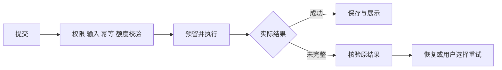

#### 异常／分支流程

| 触发条件 | 处理 |
| --- | --- |
| 相同幂等键与相同请求 | 返回同一执行，不重复生成 |
| 同幂等键但不同内容 | 409 IDEMPOTENCY_CONFLICT，不覆盖原执行 |
| 额度不足或并发超限 | 429 TRIAL_LIMIT；拒绝时模型调用为0 |
| 上游请求完成情况不确定 | 标记待确认，保存可核查字段；禁止自动补一次生成 |
| 原结果失效或超出恢复窗口 | 不承诺恢复，说明需新调用的重试；用户选择后执行 |
| 页面离开／网络中断 | 记录interrupted等状态，回到页面核验任务；持久后台队列为后续能力 |
| 无权限／任务不存在 | 拒绝并采用全局提示，不暴露供应商URL |

#### 数据字典

| 字段 | 类型 | 必填 | 说明 | 示例 |
| --- | --- | --- | --- | --- |
| taskId／jobId | string | 是 | 逻辑意图／本次执行 | task_…／job_… |
| parentJobId／attemptNo | string／integer | 重试是 | 父执行与尝试序号 | job_old／2 |
| inputFingerprint | string | 是 | 固定输入身份，回归与幂等依据 | 哈希值 |
| idempotencyKey | string | 提交是 | 一次操作去重标识 | request_… |
| status／stage／errorCode | enum／string | 是／失败时 | 实际阶段与错误 | failed／generate／PROVIDER_UNAVAILABLE |
| requestedCount／persistedCount | integer | 是 | 请求与实际成品数 | 3／2 |
| quotaDate／reservedCalls | date／integer | 执行时 | UTC账户日与预留调用 | 2026-09-30／3 |
| providerResult／usage | object | 有证据时 | 原请求、结果地址、用量 | 原请求记录 |

### 查看、修改、导出与素材管理（F06、F12、F13）

#### 描述与用户故事

用户查看已保存的图，复用素材、修改文字、下载实际文件，并管理项目与备份。其他入口保持真实能力标识。

作为运营，我希望只调整标题就得到可下载的新版本，以便不为排版修改再次生成图片。

#### 前置条件

| 类型 | 条件 |
| --- | --- |
| 权限／数据 | 当前用户拥有项目及成品；成品可读取 |
| 编辑 | 存在可复用底图与合成信息；保存需当前版本 |
| 备份 | 导入为有效JSON备份，大小≤40MB、项目数≤100 |

#### 后置条件

文字修改复用底图、生成更高assetVersion，不新增AI调用；旧质量结论不自动套用。项目保存使用expectedVersion避免覆盖。导出请求、实际文件取回与采用独立记录；JSON导入分配新ID并重新检查。

#### 界面及交互

| 元素 | 默认／校验 | 反馈 |
| --- | --- | --- |
| 预览与方案切换 | 只显示实际加载的成品 | result_viewed需已加载且可见 |
| 文案修改 | 标题18、副标题40码点；允许明确空文案 | 保存新版本并提示需重新验收 |
| 下载 | 当前成品与格式/尺寸可见 | 下载成功需真实取回并重新打开验证；点击不等于完成 |
| 删除／撤销／恢复 | 软删除，版本保护 | 可恢复，不自动清空历史 |
| 云同步 | D1元数据、R2图片；IndexedDB本地缓存 | 待同步明确展示；冲突保留副本 |
| 备份／导入 | JSON含素材；≤40MB、≤100项目 | 非法备份拒绝，不污染当前项目 |
| 标题文案入口 | 旧事实卡字段及候选受限 | 基于确认事实生成；人工选定才采用 |
| 框架需求框 | ≤1500字；数量1/2/4；示意预览 | 本地保存需求，不新增真实生成、成本或采用 |

标题文案旧事实卡字段限制：productName30、sellingPoint60、campaign18、headline18、priceOriginal20、date10；候选3条，每条1–18字。它与新图片任务的可选文案配置并存，不能强制新图片流程先填旧事实卡。尺寸加工需保证主体与文字安全区域，不能用最终画布尺寸正确代替裁切质量验收。

#### 业务流程

#### 异常／分支流程

| 条件 | 处理 |
| --- | --- |
| 文件不存在、不可读或加载失败 | 显示失败并记录result_load_failed；禁止假成功与虚假查看事件 |
| 版本落后、同一项目并发编辑 | 409，核对最新数据，保留冲突副本 |
| 断网或云端暂不可用 | 保留本地编辑和待同步状态，不宣称已云保存 |
| 跨账户或已软删除资源 | 拒绝访问；提供合法恢复动作 |
| 非法／超限备份 | 明确拒绝；原项目不变 |
| 框架预览 | 展示“示意／未实现生成”；不得出现在真实成果和成本统计 |

#### 数据字典

| 字段 | 类型 | 必填 | 说明 | 示例 |
| --- | --- | --- | --- | --- |
| expectedVersion／version | integer | 保存时是 | 乐观并发与新版本 | 4／5 |
| assetKey／mimeType | string | 成品是 | 文件键与类型 | assets/…／image/png |
| title／subtitle | string | 有编辑时 | 当前叠加文字 | 周末好物／空 |
| layout／textTone | enum | 合成时 | 布局和文字策略 | center／当前值 |
| deletedAt／syncState | datetime／enum | 条件 | 软删除时间与同步状态 | 时间／pending |
| toolType／requirementText | enum／string | 框架时 | 工具与≤1500字需求 | note／新品笔记需求 |
| exportEvent | object | 请求时 | 当前成品版本的导出意图 | assetVersion=2 |

### 人工质量、采用与方向差异（F07、F08）

#### 描述与用户故事

人工对照原图、硬约束和最终文件填写质量，区分可用与采用；同时检查整组三方向是否有实质差异。

作为质量评审者，我希望依据统一门槛记录理由，以便采用数据能回到具体版本和证据。

#### 前置条件

| 类型 | 条件 |
| --- | --- |
| 证据 | 当前版本原图、约束、成品和自动检查均可读取 |
| 权限 | 用户有权评审本任务及成品 |
| 版本 | 提交必须针对当前assetVersion，防止旧图评分写到新图 |

#### 后置条件

反馈追加保存并留存历史；采用必须满足合格门槛及当前自动文件检查。撤销采用、修改成品或输入版本后，应使当前有效采用结论同步变化；统计不能保留失效采用。

#### 界面及交互

| 元素 | 默认／范围 | 校验与反馈 |
| --- | --- | --- |
| 商品事实门 factsPass | 待填写boolean | 数量、形态、包装及确认事实通过；看不清则不得放行 |
| 需求门 requirementsPass | 待填写boolean | 自定义文案、禁止元素、尺寸／布局意图均满足 |
| 交付门 deliveryPass | 待填写boolean | 文件实际可取回、可读，目标规格正确 |
| 四维评分 | 构图／风格／光影／文字，每项整数0–2 | 0=明显不可用；1=可接受但需少量修改；2=达到该项要求 |
| 修改程度 editLevel | direct／minor／redo | 重做不可判合格 |
| 修改分钟 editMinutes | 整数0–600 | 合格须≤10；如需要独立计时测试则保留实测证据 |
| 备注／拒绝原因 | 备注≤800；原因≤60 | 说明不通过项及证据 |
| 采用 adopted | 默认不自动采用 | 只有三门通过、每维≥1、总分≥6、非redo、分钟≤10且自动检查通过才允许 |
| 组差异 | 场景／构图／配色／信息层级 | 至少2个实质差异维度；仅换色或文字不足 |

UI允许对至少2张成品填写组评审；“三方向差异合格率”只统计实际完整3张的组。部分组可记录意见，但不能进入完整三方向KPI分母。

#### 业务流程

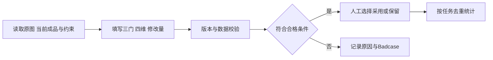

#### 异常／分支流程

| 条件 | 处理 |
| --- | --- |
| 自动检查不通过／硬门失败／分数或修改量不合格 | 不能保存为有效采用；允许记录不合格反馈 |
| 旧assetVersion、分数非整数、分钟超限 | 409或400，要求重新读取与修正 |
| 同feedbackId重复、同内容 | 幂等返回已有记录 |
| 同feedbackId不同内容 | 409，不篡改已有反馈 |
| 断网、无权限、证据缺失 | 保留填写内容并提示失败；不计入已完成评审 |

#### 数据字典

| 字段 | 类型 | 必填 | 说明 | 示例 |
| --- | --- | --- | --- | --- |
| feedbackId／assetId／assetVersion | string／string／integer | 是 | 反馈及对应成品版本 | fb_…／asset_…／2 |
| factsPass／requirementsPass／deliveryPass | boolean | 是 | 三个硬门 | true／false／true |
| composition／style／light／text | integer | 是 | 每项0–2 | 2／1／2／1 |
| editLevel／editMinutes | enum／integer | 是 | 修改程度与分钟 | minor／6 |
| eligible／adopted | boolean | 是 | 系统合格判定与人工采用选择 | true／false |
| note／rejectReason | string | 条件 | 备注≤800、拒绝原因≤60 | 主体裁切 |
| diversityAxes／groupCount | array／integer | 组评审时 | 实质差异维度与实际组数 | scene,composition／3 |

### Badcase归因与回归（F09）

#### 描述与用户故事

记录真实不符合项、影响、证据、待验证原因与修复方式，按同条件新证据确认修复。

作为维护者，我希望区分确定根因与猜测，并看到对应的回归结果，以便不把方案说明误当作已经修好。

#### 前置条件

| 类型 | 条件 |
| --- | --- |
| 证据 | 至少明确任务、方向／阶段、成品版本或失败记录 |
| 权限 | 拥有任务或内部授权评测环境 |
| 回归 | 输入指纹、模型及规则变更可追踪；回归候选满足同条件要求 |

#### 后置条件

保存open/investigating/closed与版本历史。关闭应记录回归证据；视觉／反馈类还需对应新版本人工通过并采用，执行类需失败阶段通过且请求数量完整。当前五条问题均调查中，禁止仅编辑文字就关闭。

#### 界面及交互

| 元素 | 默认／限制 | 行为 |
| --- | --- | --- |
| 问题分类与严重度 | 商品／约束／交付／排版；P0/P1 | P0先修商品裁切与硬约束；不按评分总分掩盖 |
| 问题证据 | job、方向、图片、阶段、版本 | 可定位具体结果；记录实际而非推测的上游错误 |
| 归因／修复说明 | 各≤1500字 | 事实、已确认原因、假设与验证动作分开 |
| 回归候选 | 同输入指纹、模型条件相符 | 新真实job或更高assetVersion；必要时复用底图 |
| 关闭 | 默认调查中 | 门槛未满足拒绝；人工结论不能由AI自动冒充 |

#### 业务流程

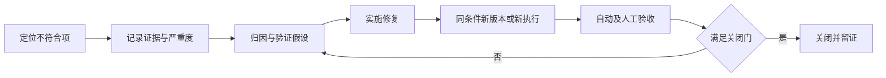

#### 异常／分支流程

| 条件 | 处理 |
| --- | --- |
| 输入或模型不一致 | 不当作同条件回归；说明差异与可验证范围 |
| 只重用旧版本、缺自动检查或人工结果 | 不关闭问题；提供明确缺失项 |
| 仅原任务恢复 | 可以证明交付取回；新增生成应为0；其他质量问题仍需新版本证据 |
| 问题并发更新或证据版本变化 | 409并刷新；旧证据保留，不被新文本覆盖 |
| 无权限、断网、证据消失 | 不保存成功状态；保留编辑并提示 |

#### 数据字典

| 字段 | 类型 | 必填 | 说明 | 示例 |
| --- | --- | --- | --- | --- |
| badcaseId／jobId／assetId | string | 是／条件 | 问题与执行／成品关联 | BC02／job_…／asset_… |
| severity／status | enum | 是 | 严重度与状态 | P0／investigating |
| stage／errorCode／assetVersion | string／integer | 条件 | 执行和文件证据 | compose／…／1 |
| analysis／fix | string | 归因时 | 各≤1500字，假设需显式说明 | 比例异常导致cover裁切 |
| regressionId／candidateJobId | string | 回归时 | 新执行或新版本证据 | reg_…／job_new |
| regressionInputFingerprint | string | 回归时 | 同条件核对 | 与基线指纹一致 |
| expectedVersion | integer | 写入时 | 防止并发覆盖与假关闭 | 3 |

### 评测、评分复核与证据交付（F10）

#### 描述与用户故事

按冻结用例执行真实任务，保存输入、输出、耗时、调用与确定性校验；独立评估器评分，人工复核原始判断。评测工具是内部辅助，不改变产品采用结论。

作为课程与测试评审者，我希望从一个用例追踪到原图、成品、规则、评分和复核理由，以便验证执行真实且结论不越界。

#### 前置条件

| 类型 | 条件 |
| --- | --- |
| 用例 | 输入、参数、环境、期待结果、版本与用途明确，MOCK与真实区分 |
| 执行 | 模型预算已授权；文件与状态真实保存 |
| 评分 | Rubric和证据范围声明；视觉判断必须提供图像并另行验证 |
| 复核 | 工具有任务权限；图片在允许证据根目录内，路径与哈希核验 |

#### 后置条件

保留原始执行、评分、版本与不可变复核历史。判错时追加修正意见，不覆盖AI原始评分；待判断时说明缺失证据。导出可以携带最新复核及历史。没有正式复核记录时显示0。

#### 界面及交互

| 元素 | 默认／范围 | 行为 |
| --- | --- | --- |
| 结果列表 | 当前任务评分与筛选 | 展示原始分、通过状态、理由和评估范围 |
| 人工复核／开始复核 | 原图、成品、Rubric、历史 | 判断“判对了／判错了／暂时无法判断” |
| 复核理由 | 必填1–4000字 | 说明证据与判断；空理由不保存 |
| 修正分数／通过状态 | 判错时可选，受Rubric上下界约束 | 仅作为人工追加结论 |
| 保存 | expectedVersion与幂等键 | 同请求重复安全；版本冲突拒绝 |
| 导出 | CSV/XLSX，最新及历史 | 保留AI原始结果，不冒充第二轮真实执行 |

非视觉评估v1对生成场景使用：交付完整性40、文件与尺寸20、明示文本约束20、文案事实约束20。分数阈值80，同时硬条件须满足，所以87分仍可能未通过。该评估器没有收到图片像素，商品还原、裁切、光影、像素约束、商用质量和采用均在范围之外。

#### 业务流程

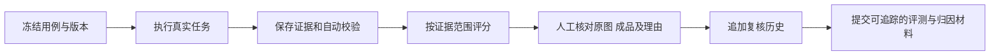

#### 异常／分支流程

| 条件 | 处理 |
| --- | --- |
| 重复MOCK行对应相同真实输入 | 去重后报告独立场景数量；不以行数增加样本 |
| 没有图像或确认事实 | 评估器声明未评估／待复核，不强判像素质量或事实虚构 |
| 分数高但视觉不合格 | 保留评分范围，继续登记产品问题 |
| 证据不在允许目录、哈希不符 | 拒绝读取并记录；不放开整个磁盘路径 |
| 同幂等键异内容、版本冲突 | 409；不覆盖历史 |
| 无权限、离线或任务数据缺失 | 明确失败／未完成，不能捏造复核人或复核记录 |

#### 数据字典

| 字段 | 类型 | 必填 | 说明 | 示例 |
| --- | --- | --- | --- | --- |
| batchId／caseId | string | 是 | 批次和独立用例联合身份 | real-eval-20260930-v1／C06 |
| codeCommit／environment | string／enum | 是 | 执行版本与环境 | 487a7006…／evaluation |
| evaluationTaskId／rubricVersion | string | 评分时 | 评分任务与规则版本 | cmunznt6d001zbxi8x06xa07u／非视觉v1 |
| originalScore／originalPass | number／boolean | 评分时 | 原始AI结果，不覆盖 | 80／false |
| judgment／reason | enum／string | 复核时 | 判定及1–4000字依据 | 待判断／需核对包装标签 |
| correctedScore／correctedPass | number／boolean | 可选 | 人工修正意见 | 受Rubric范围约束 |
| expectedVersion／idempotencyKey | integer／string | 复核时 | 并发与重复保护 | 1／review_req_… |
| evidencePath／evidenceHash | string | 证据时 | 限定目录和完整性 | C06/input.png／哈希 |

### 指标、追踪与环境隔离（F11）

#### 描述与用户故事

系统记录真正发生的输入、执行、取回、评审和采用事件，使质量、速度和成本可追溯。按环境和版本隔离统计，不把评测或框架点击算作生产成果。

作为项目负责人，我希望看到口径明确的采用、失败与真实成本，以便判断是否值得继续试用。

#### 前置条件

| 类型 | 条件 |
| --- | --- |
| 事件 | 有task/job/project及环境，事件确实发生 |
| 质量指标 | 当前版本的人工合格与采用可关联 |
| 成本指标 | 实际调用账单、失败与重试费用、存储分摊规则可核查 |
| 外部追踪 | 运行环境配置和凭据有效；历史回填与实时导出分别验证 |

#### 后置条件

事件、用量与反馈可按任务关联；分母、环境、版本、时间窗公开。缺少采用或账单时返回null／未测。追踪失败不伪装为已发送并读回成功。

#### 界面及交互与指标口径

| 指标 | 计算与去重 | 解释 |
| --- | --- | --- |
| 北极星 | production；北京时间周一至周日；首次有效采用逻辑task去重；以当前合格版本为准 | 不含evaluation/legacy/mock；撤销与版本变更需正确更新 |
| 首次可用率 | 首次执行便合格且采用的正向task／接受的正向task；技术失败留在分母 | 人工待评单独显示，不能当通过或剔除失败 |
| 完整交付率 | 实际完整交付task／接受的正向生成task | 部分不算完整；与合格率、采用率分别统计 |
| 成品保存率 | 实际可读保存数／请求成品数 | 29/30不意味着29张都商用合格 |
| 三方向差异合格率 | 人工≥2实质差异维度的完整3张组／已评审完整3张组 | 部分组与1张模式不混入 |
| 端到端耗时 | 接受任务至预处理、生成、保存与检查完成；同时给样本数与分位算法 | 本批n=10、nearest-rank；不当生产SLA |
| 有效采用单任务成本 | 真实分析＋生成＋失败/重试＋存储分摊总费用／有效采用task | 分母0或缺账单→null/未测；不能填0元或演算样例 |
| 导出 | 请求、真实下载取回、用户采用分别统计 | 下载不等于发布、投放或转化 |

#### 业务流程

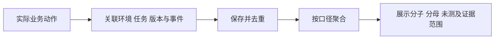

#### 异常／分支流程

| 条件 | 处理 |
| --- | --- |
| 分母为0、人工未评、缺真实账单 | 返回未测／null并说明缺口 |
| 事件重复或异步补传 | 按事件身份去重，保留关联，不重复计采用 |
| 追踪未配置、网络失败 | 记录未导出与重试状态；产品保存不依赖追踪成功 |
| 环境不明或列表截断 | 不计为完整生产指标，先核对环境与范围 |
| 无权限 | 只展示本人／授权内部环境，不暴露其他账户用量和文件 |

#### 数据字典

| 字段 | 类型 | 必填 | 说明 | 示例 |
| --- | --- | --- | --- | --- |
| eventId／eventName | string | 是 | 去重与事件名 | ev_…／asset_feedback_saved |
| environment／workflow | enum | 是 | 业务环境与流程 | evaluation／reference_scene_edit |
| taskId／jobId／assetVersion | string／integer | 条件 | 业务意图、执行、文件版本 | task_…／job_…／2 |
| timestamp／durationMs | datetime／number | 是／条件 | 实际动作时间与持续时长 | ISO时间／102844 |
| model／usage／cost | string／object／number或null | 条件 | 冻结模型、真实用量和账单成本 | 执行值／…／null |
| exportState／traceId | enum／string | 追踪时 | 导出状态与外部关联 | pending／trace_… |

F14团队权限、图文／视频编排属于后续范围；未来实现时需单独形成职责、跨账户数据边界、任务编排和验收设计，本稿不将规划写为交付。

## 非功能需求（注意事项）

### 安全与合规需求

| 需求 | 用户与证据相关要求 | 验证方式／状态 |
| --- | --- | --- |
| 账户所有权 | 项目、成品、任务、反馈和问题均核对owner；跨账户不得访问 | 双账户读取与写入测试；已有防护实现，扩大范围需验收 |
| 凭据与传输 | 模型密钥在平台服务端配置，不要求用户提交密钥；线上HTTPS；日志不得包含密钥 | 配置与请求核对；不把“配置存在”当泄漏测试 |
| 写入来源 | 同源写入检查和当前登录身份；敏感更新使用expectedVersion或幂等键 | 跨源、并发与重放测试 |
| 证据文件访问 | 评测工具限制证据根目录并核验哈希；不因图片复核放开全磁盘 | 隔离目录与非法路径测试已有；正式用例保留结果 |
| 商品事实与使用授权 | 用户有权使用上传商品素材；文案不能编造已确认事实以外的商业属性 | 需求提示、人工核对；本稿不作未核实的法律结论 |
| 数据生命周期 | [待确认 D04] 原图、成品、失败记录、反馈与回归需有保留和清理策略 | 建议试用期保留完整证据、采用软删除；永久清理前确认备份、范围和责任人 |
| 审计与隐私 | 留存版本、操作、复核与回归历史；追踪导出图片和商品信息前明确最小范围 | 评审数据字典与配置；不得把未配置追踪当默认上传 |

### 统计需求（埋点）

通用属性按场景包含eventId、timestamp、environment、projectId、taskId、jobId、assetId/assetVersion、workflow、ruleVersion、durationMs、errorCode。不得在通用埋点中发送模型密钥或无必要的图片正文。

| 事件名 | 触发时机 | 关键属性 | 当前状态与验收 |
| --- | --- | --- | --- |
| product_input_started／ready／failed | 开始输入、验证就绪、输入失败 | 类型、大小、阶段、错误 | 已有；失败输入新增模型调用为0 |
| cutout_started／completed | 开始及结束预处理 | 方式、耗时、fallback | 已有；不能自动推断视觉正确 |
| generation_accepted | 服务端正式接受任务 | task/job、数量、输入版本、环境 | 已有；拒绝与接受分开 |
| 阶段追踪 | analysis/generate/compose/persist等阶段 | 方向、模型、耗时、实际错误与用量 | 已有；非真实上游状态码不补写 |
| composition_completed／asset_persisted | 合成完成／文件真实保存 | 成品版本、尺寸、存储 | 已有；只保存元数据不足以计成品 |
| asset_rule_checked | 完成自动规则检查 | 规则版本、结果、范围 | 已有；不包含未执行的人工视觉结论 |
| result_viewed／result_load_failed | 文件加载且可见／加载失败 | 成品版本、方向、错误 | 已有；只渲染空卡片不算查看 |
| retry_requested／recovery_requested | 用户选择重试／原结果恢复 | 父任务、原因、范围、调用变化 | 已有；两者不能合并成新生成 |
| asset_feedback_saved | 当前版本评审成功持久化 | 三门、四维、修改量、合格和采用 | 已有；失败保存不统计完成 |
| group_diversity_reviewed | 人工保存组差异结论 | 实际组数、差异轴、评审版本 | 已有；3方向KPI排除部分组 |
| quick_export_requested | 用户请求当前文件导出 | 文件与版本、用途 | 已有；与实际下载成功分开 |
| workspace_page_view／export_file_verified | [新增需求] 工作台实际进入／导出文件实测可打开 | 页面、环境、版本／文件尺寸与哈希 | 未完整实现；避免用请求事件代替结果 |

生产看板按账户和环境提供范围。PV/UV与成功事件须给去重依据；如尚未实现page_view独立事件，应标注新增需求，不能凭页面存在宣称已有完整访问统计。

### 性能与可靠性需求

| 指标 | 实测基线或建议 | 边界与验证 |
| --- | --- | --- |
| 图片任务端到端 | 本批10个正向任务：P50 102.844秒、P95 188.320秒 | 含预处理、保存、检查；nearest-rank；只是评测环境基线 |
| 本地编辑交互 | [待确认 D05] 建议P95≤1秒 | 指文字设置、已有底图重合成；排除首次抠图模型下载；需实测 |
| 非模型元数据接口 | [待确认 D05] 建议P95≤3秒 | 指项目／任务读取与元数据写入；图片传输、AI执行分开计时 |
| 稳定性 | 不因追踪不可用丢失成品；成功方向不因另一路失败丢失 | 实际故障演练E02；不存在已验证99.9%承诺 |
| 账户并发 | 当前最多2个queued/running；页面聚焦1个 | 不等于平台总并发容量；容量需试用前验证 |
| 初次抠图 | 模型下载约16MB，加载与失败可见 | 不设未经验证的“首屏2秒”或网络超时固定值 |
| 灰度与回滚 | [假设 H02] 先内部与少量账户验证，P0商品／硬约束问题未关闭时暂停扩大 | 确认生产回滚版本、配置与数据兼容后试用；D02/D05 |

### 数据库设计与生命周期

本表描述当前核心数据职责，字段契约见各功能字典，具体SQL由研发维护。当前云端D1保存元数据、R2保存图片；本机真实评测使用本地SQLite与本地文件；评测工具有独立数据库，不能把两者记录合成一套生产反馈。

| 表／对象 | 职责与主要关联 | 关键约束 |
| --- | --- | --- |
| projects | 本人项目、配置、版本、软删除 | owner隔离、expectedVersion；恢复不覆盖新记录 |
| generation_jobs | 执行、taskId、parentJobId、attemptNo、输入指纹、环境、workflow | 幂等；状态、实际数量、失败和用量保存 |
| daily_quota | UTC账户日调用限额与预留 | 并发预留正确；不解释为现金预算 |
| creative_assets | 文件位置、方向、尺寸、assetVersion、自动检查 | 不用缺文件元数据充成品；旧版本可追溯 |
| asset_feedback／quality_reviews | 人工三门、四维、修改量、采用与组差异 | 追加历史、版本匹配、同feedbackId幂等 |
| quality_badcases／quality_regressions | 归因、修复、版本、候选与回归证据 | 有证据才关闭；CAS保护 |
| workspace_events／telemetry_events | 用户动作、环境与实际阶段 | 事件去重、范围与版本明确 |
| langfuse_exports | 追踪导出状态与外部关联 | 发送与读回分别验证，不把历史回填当实时成功 |
| 评测工具EvaluationReview | 原评分对应的人工复核与历史 | 原AI结论不覆盖，权限、幂等、expectedVersion |
| IndexedDB／JSON备份 | 本地项目与待同步，素材备份 | 冲突副本；导入新ID；大小与数量校验 |

读写应按owner与任务／项目关联查询；反馈、回归、追踪需按环境、版本、时间查询。索引和全量分页的具体实现由容量验证决定，不伪造已上线索引。D04需在扩大试用前明确保存周期、永久删除与备份检查。

### 系统集成与接口契约

| 对接对象 | 方向与方式 | 契约与降级 |
| --- | --- | --- |
| 平台登录与所有权 | PC工作台→服务端 | 当前登录身份决定数据范围；无权限拒绝 |
| 视觉分析与图像供应商 | 服务端→供应商；HTTP | 冻结模型与版本；保留真实错误、结果与用量；不自动无限重试 |
| D1／R2 | 服务端读写元数据／图片 | 结果保存确认后才计交付；故障支持取回原结果 |
| IndexedDB | 浏览器本地缓存与待同步 | 离线可保留草稿；服务端版本核对后同步 |
| Langfuse | 内部追踪导出与回查 | 本批历史10条trace、157observations、67scores，共224记录发送并读回；运行中的自动导出未完成配置验证 |
| Eval-Any-Agent | 本地真实证据→独立评分与人工复核 | 12个独立场景；复核追加历史；本机链接不承诺外网可访问 |

| 接口族 | 已有路由 | 关键输入／输出与失败 |
| --- | --- | --- |
| 状态 | GET /api/status | AI配置、存储及运行状态；不泄露密钥 |
| 项目 | GET /api/projects；GET/PUT /api/projects/{id}；POST /api/projects/{id}/trash | owner、项目、expectedVersion；400/404/409 |
| 图片 | GET /api/assets/{key} | 文件和owner核对；丢失／越权不能假成功 |
| 任务 | GET/POST /api/jobs；GET /api/jobs/{id} | 冻结选项、幂等、配额；400/413/409/429/503 |
| 执行动作 | POST /api/jobs/{id}/run、recover、compose、feedback、export | 动作、当前版本、父任务／原结果；重试与恢复调用变化 |
| 质量 | GET /api/quality/identity、overview、jobs/{id}；POST jobs/{id}/check、diversity；POST assets/{id}/feedback | 环境、assetVersion、三门与评分；RULE_FAILED、版本冲突 |
| 问题 | GET /api/quality/badcases；GET/POST /api/quality/badcases/{id}；GET candidates；POST regressions | 问题版本、同条件证据、关闭门；400/404/409 |
| 指标与追踪 | POST /api/telemetry、/api/events；GET /api/metrics；GET /api/quality/jobs/{id}/langfuse | 事件、环境、范围；追踪与统计不替代产品交付 |

上述为现有接口族，不是新增公开API开放承诺。典型错误包括IMAGE_REQUIRED、INVALID_QUICK_SETTINGS、INVALID_IMAGE、IMAGE_TOO_LARGE、NOT_FOUND、IDEMPOTENCY_CONFLICT、TRIAL_LIMIT、STORAGE_UNAVAILABLE、PROVIDER_UNAVAILABLE、RESULT_UNCONFIRMED；上游5xx或超时必须有原始证据，不能由泛化错误码推定。

## 附录（补充文档）

### 验收标准与测试要点

验收用例必须记录版本、环境、输入、实际输出、证据与执行者。“要求如下”不意味着本次已重跑。当前提交上的88项自动化测试为先前已通过记录，本轮PRD编写没有重跑全部测试；以下真实E2E及人工验收按状态记录。

| TC | 对应功能 | 可执行的验收条件 | 优先级／当前证据 |
| --- | --- | --- | --- |
| TC01 | F01 | 上传合法PNG/JPG/WebP≤8MB，保留原图，预处理可选，保存与重新打开一致 | P0／已有真实输入 |
| TC02 | F01 | 缺图返回400 IMAGE_REQUIRED，损坏／非法图拒绝；新增模型调用=0 | P0／C12缺图已验证；其余需边界补测 |
| TC03 | F01 | 超前台或服务端限制拒绝，不丢其他配置；抠图失败可保留原图重试 | P0／正式边界待补 |
| TC04 | F02 | 仅允许conceptCount1/3、两种比例；无效设置400且新增调用=0 | P0／服务端实现；专项待补 |
| TC05 | F02 | 自定义文案开启且空，成品不加新叠加文字；原包装印刷文字仍保留 | P0／C11非视觉已验证，像素人工待验 |
| TC06 | F02 | 标题18/19、副标题40/41、背景500/501、含emoji的边界一致校验，超限0调用 | P0／C10标题17合法、20拒绝已验证；边界组合待补 |
| TC07 | F02 | 执行时更改草稿，原任务输入、模型、规则与指纹不变；下一任务用新值 | P0／专项待补 |
| TC08 | F03 | 低于0.7品类置信度回general；不把分类当商品事实；无效分析安全兜底 | P0／实现已有，边界记录待补 |
| TC09 | F03 | 原图可见包装与确认事实不被虚构商业属性覆盖；三／多主体数量正确 | P0／C04/C05/C07已有成品，人工及E05待补 |
| TC10 | F03 | 1方向默认scene；3方向独立生成且有至少2维实质差异 | P1／独立调用已有，人工差异未测 |
| TC11 | F04 | 三方向全部实际保存可读时才完整；2/3明确部分并保留成功图 | P0／9完整1部分已真实验证 |
| TC12 | F04 | 返回比例偏差可识别且不裁掉商品；最终画布规格正确，同时商品完整 | P0／C06 graphic失败，BC02待修复 |
| TC13 | F04 | “禁止新增水果”等像素硬约束满足；中文无行首逗号／孤尾，局部文字清楚 | P0商品约束／P1排版；BC03–05待修复 |
| TC14 | F05 | 相同幂等键同请求返回同执行、0重复生成；异内容409 | P0／实现及自动测试已有，E03正式待补 |
| TC15 | F05 | 额度不足／账户已有2个活动任务时拒绝，不新增模型调用，UTC日边界正确 | P0／专项待补 |
| TC16 | F05 | 供应商已完成后注入保存失败，recover取回原结果，新增生成=0 | P0／E02待正式执行 |
| TC17 | F05 | 失效／未知原结果不自动再付费；用户重试产生关联新执行及正确成本 | P0／E03待正式执行 |
| TC18 | F06 | 真实下载文件后重新打开，尺寸、文字、当前版本正确；不能只测试按钮点击 | P0／E01待正式记录 |
| TC19 | F06 | 只改标题复用底图，assetVersion增加，AI调用=0；旧采用不能沿用 | P0／正式回归待补 |
| TC20 | F06 | 并发版本冲突409并保留副本；软删可撤销；离线待同步不伪称已云保存 | P0／实现已有，正式复验待补 |
| TC21 | F06 | 备份40MB/100项目边界；非法输入拒绝；合法导入新ID且需复核 | P1／专项待补 |
| TC22 | F07 | 三门、四维、修改量按门槛判合格；不合格不得有效采用；旧版本409 | P0／实现已有，产品人工0/29 |
| TC23 | F07 | 同feedbackId同内容幂等、异内容409；撤销采用及新版本使有效指标变化 | P0／E04正式待补 |
| TC24 | F08 | 至少2张可记录差异意见；3方向KPI只含完整3张且≥2维差异组 | P1／人工待验 |
| TC25 | F09 | 输入／模型不一致、仅旧版本或缺人工证据时不能关闭；归因明确假设 | P0／5条investigating，回归0 |
| TC26 | F09 | 新真实job或更高assetVersion满足相应门后，保存回归与关闭证据；CAS冲突拒绝 | P0／正式待验 |
| TC27 | F10 | 原始12条分数保留；C08/C09补证据复核，不直接改写通过率 | P1／正式人工0/12 |
| TC28 | F10 | 复核必填理由1–4000；版本/权限/幂等有效；历史与导出不覆盖AI原始结论 | P1／隔离测试与构建已有；真实使用待执行 |
| TC29 | F11 | environment隔离、task去重；采用／撤销、跨周和成品版本变化正确；未测不填0元 | P0指标可信度／E04及E08待补 |
| TC30 | F11 | 新真实任务的追踪自动发送且读回关联正确；未配置时明确失败；不以历史224记录替代 | P1／运行配置核验待补 |
| TC31 | F12 | 确认事实下生成3条1–18字候选，不编商业属性；抠图与适配不破坏主体 | P1／专项人工质量待补 |
| TC32 | F13 | 需求≤1500字、数量1/2/4可保存恢复；示意明确，真实生成/成本/采用均不新增 | P1状态可信度／正式复验待补 |

#### 真实E2E补充矩阵

| 编号 | 必须保留的证据 | 当前状态 |
| --- | --- | --- |
| E01 真实导出 | 下载到文件、重新打开、尺寸／文字／哈希 | 待正式验收 |
| E02 保存故障恢复 | 已生成→注入保存失败→原结果恢复；新增调用0 | 待正式验收 |
| E03 重试与幂等 | 重复提交、新关联执行、调用与成本差异 | 待正式验收 |
| E04 采用与统计边界 | 采用、撤销、新版本、北京时间跨周、task去重 | 待正式验收 |
| E05 多主体商品 | 三SKU／多件商品数量、形态和安全区域 | 待专项验收；已有3袋/2瓶/7件样例非正式放行 |
| E06 品类覆盖 | 电子、服装、家居相同规则下的真实结果与人工评分 | 待执行；本批主要食品饮料 |
| E07 同条件版本B | 输入、模型、变更、成品版本、差异与回归 | 待执行；不能把证据重放当B版生成 |
| E08 用户价值与成本 | 配对任务工时、修改、采用、实际账单与分摊 | 待执行；采用、成本、ROI未测 |

#### 产品本版验收门

评审版PRD完成与产品验收完成分别记录。图片核心正式验收要求：P0商品裁切与像素约束问题有真实修复证据；本批29张完成产品人工评审；12条原评分完成正式人工复核并保留争议；对应关闭问题有回归；E01–E04完成交付与指标关键边界；线上质量及追踪链路核验。未通过素材不计为有效采用；不要求人为把所有结果判为合格。后续扩大试用再验证品类、工时和真实成本。

### 最新真实评测基线

| 项目 | 实际结果 | 解释 |
| --- | --- | --- |
| 批次／版本／环境 | real-eval-20260930-v1／版本A／evaluation | 主产品commit487a7006…；不是线上生产全量统计 |
| 场景数 | 原20行MOCK映射去重→12个真实独立场景 | 10个正向生成、2个边界；不能以20或24当独立样本 |
| 实际交付 | 9/10完整组=90%；1部分组；29/30成品=96.7% | 完整交付率≠商用合格率≠采用率 |
| 模型调用 | 30次图像尝试、10次有用量的视觉分析 | 失败与分析也应计真实成本；本轮没有新增付费请求 |
| 确定性契约 | 11/12用例；已有文件29/29通过文件检查 | 不评商品还原、主体裁切或设计质量 |
| 时长 | P50 102.844秒；P95 188.320秒 | 正向n=10、nearest-rank、端到端；样本小不外推SLA |
| 独立非视觉评分 | 12/12调用完成；9通过、3未通过；均分95.58/100 | 正向7/10、边界2/2；没有图片像素 |
| AI视觉预审 | 11条预审，覆盖10个正向用例 | 非人工；不自动采用或关闭问题 |
| 产品人工／正式评分复核 | 0/29成品；0/12评分 | 采用率、商用可用率、真实成本、ROI均未测 |
| 问题／回归 | 5条investigating；回归0 | 修复方案和历史PRD文字不能改变此状态 |
| 证据图片 | 9个独立输入图、11份输入副本、29输出，共40证据图片 | 副本不新增独立样本 |
| 追踪 | 10条trace、157observations、67scores，合计224历史回填并读回 | 运行时自动导出未完成配置验证；云端质量记录最近核对为空 |

原评分三条未通过：C02 87分（只保存2/3张）、C08 80分、C09 80分。C08原图写“紫米爆珠”，C09写“燕麦＋草莓”；非视觉评估器未收到这些原图和事实清单，其事实扣分需人工核对。不能直接宣布纠正后11/12通过。C06为100分但仍存在主体裁切和新增水果问题，这说明评分范围必须与视觉验收分开。

### Badcase清单与归因复盘

| ID／优先级 | 真实问题与证据 | 原因确定性 | 修复与回归要求 | 状态 |
| --- | --- | --- | --- | --- |
| BC01／P1 | C02 graphic失败；125.24秒；PROVIDER_UNAVAILABLE；仅2/3张 | 缺真实上游状态与requestId，不能确定5xx或超时 | 保留2张；补原调用证据；先恢复判断，需新调用时说明；完整交付回归 | investigating |
| BC02／P0 | C06 graphic请求1024×1536，返回1491×1055横图；最终1080×1440左侧主体缺损 | 比例偏差叠加cover裁切，未做主体安全区保护 | 识别实际比例；保全主体；优先复用原底图0生成重合成；新版本人工通过 | investigating |
| BC03／P0 | C06 scene在禁止新增水果时增加半个牛油果 | 文本约束进入计划，但像素未验证；食品配方干扰为待验证假设 | 明确排除约束与像素校验；同输入模型新证据；人工确认不新增水果 | investigating |
| BC04／P1 | C05 scene/graphic、C09 graphic有行首逗号或孤立尾行 | linesFor缺少中文禁则与尾行优化 | 复用底图修正换行，新增生成0；新版本检查与人工评分 | investigating |
| BC05／P1 | C03 studio白字落在明亮局部，标题不清 | 使用区域平均而非文字覆盖处局部对比 | 局部对比、文字色／位置／底衬调整；新版本验收 | investigating |

#### C06视觉证据

以下图片来自本批真实证据目录，展示原图及失败成品。它们用于说明问题，不代表推荐的最终效果。新增文件上传到本PRD不等于新的模型生成。

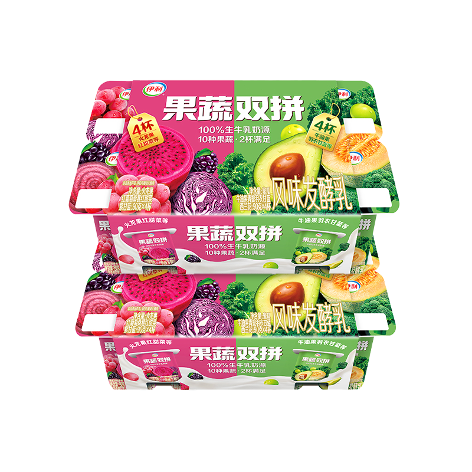

C06原图：作为商品形态、数量与可见标签的核对起点。

C06 scene：用户禁止新增水果，但画面加入半个牛油果；非视觉文本校验无法据此放行。

C06 graphic：最终画布是1080×1440，左侧商品仍被裁切；最终尺寸正确不足以证明交付合格。

### 作业证据与提交说明

课程录音逐字稿（2026-09-27 19:17:56，北京时间，约26分50秒）的约00:25:51要求为：“作业的话，跑一下自己项目的评测，包括说 badcase 的归因复盘。”以下映射以真实要求与证据为依据，不额外声称课程强制20/30样本、全部问题关闭或ROI。

| 要求／提交内容 | 已有证据 | 仍需补足 |
| --- | --- | --- |
| 跑自己项目评测 | 12独立场景真实执行；原图、成品、时长、调用与文件校验 | 提交时明确本机版本A、环境和样本边界 |
| 评分与业务标准 | 非视觉v1原始12条评分、范围及Rubric；产品人工门槛 | 正式复核12条；视觉评分29张尚未完成 |
| Badcase归因复盘 | 5条真实问题、图片、阶段、确定原因／假设与修复路径 | 不将假设写为确认根因；实施后的真实回归尚无 |
| 结果可信 | 完整／部分、环境、重复样本、未测指标分别解释 | 原始通过率保留，新增人工结论单独呈现 |
| 产品需求完整性 | 本PRD功能、边界、指标、接口、TC及E矩阵 | 决策项需评审确认；不因此声称产品已验收 |

本版PRD和首轮真实评测／初步归因可以用于评审和作业材料。若报告宣称“问题已修好、商用可用、用户已采用或ROI达标”，必须先取得相应真实证据；当前不能做此结论。

### 待确认项与假设

独立清单[《造物营 PRD 待确认项（Skill标准版）》](https://my.feishu.cn/docx/DIUfd394noTTDIxLDJrcGSMxnFe)同步交付。本文保留标记，建议值可用于评审讨论，不等于用户或教师已经批准。

| ID | 标记／事项 | 默认建议 | 影响与时点 |
| --- | --- | --- | --- |
| D01 | [假设 H01] 用户价值与旧流程缺真实研究 | 先验证核心商家／设计任务，保留配对旧流程和返工证据；不填写收益结论 | 必须在价值／商用结论前确认；不阻塞本稿 |
| D02 | [待确认] 试用样本与目标；[假设 H02] 灰度 | 先内部小范围；至少20正向任务初步观察、首次可用率试用目标≥70%；P0未关闭暂停扩大 | 建议试用前确认；影响通过标准及投入 |
| D03 | [待确认] 每日调用、预算与告警 | 维持现有授权额度；无自动付费重试；负责人核账 | 必须扩大付费试用前确认；影响成本控制 |
| D04 | [待确认] 保存周期、清理与追踪隐私 | 试用阶段保留证据、软删除；永久清理前确认备份与范围 | 必须扩大试用前确认；影响数据生命周期 |
| D05 | [待确认] 性能、浏览器、容量和回滚 | Chrome/Edge；两种PC分辨率；本地编辑P95≤1秒、元数据P95≤3秒作为建议目标；先实测 | 建议试用前确认；不能当已测SLA |
| D06 | [待确认] 团队角色与后续权限 | 本版单账户所有权，团队RBAC和审批后续独立设计 | 可后续补充；若改为多人协作则阻塞相应设计 |

### 资料、版本与复核入口

| 资料 | 地址或标识 | 使用说明 |
| --- | --- | --- |
| 线上演示 | [造物营 PC工作台](https://material-studio-demo.changfangzhen4.chatgpt.site) | 最近已验证发布V14；不把本机评测数据解释为线上生产 |
| 项目原始业务资料 | [造物营主产品资料](https://my.feishu.cn/docx/Yi22dTgF7oTrf8xKh4hcHuWXnNb) | 最近读取rev714；较大平台愿景及演算指标需按本稿边界理解 |
| 历史质量方案 | [质量评测与问题闭环资料](https://my.feishu.cn/docx/QVBndk9egoGTKZx9WGJcIb2bnic) | 历史rev25，仅作来源；旧数量与状态不作为当前基线 |
| 实际代码 | material-studio，commit487a7006e357277fc08e345c4dcbf77cd6955011 | 本地开发仓库；保留可追踪提交 |
| 真实证据包 | 个人项目/outputs/real-eval-20260930 | 包含真实评测报告、summary、逐例输入/成品、原始评分、Badcase；本地材料需随作业另附 |
| 产品人工评审 | 本机 http://127.0.0.1:4173/#quality | 选择内部评测；仅本机服务运行时可访问，不是公开网址 |
| 正式评分复核 | 本机 http://127.0.0.1:3000/dashboard/evaluation-tasks/cmunznt6d001zbxi8x06xa07u/results | 点击人工复核／开始复核；独立于产品采用 |
| 课程要求来源 | 2026-09-27课程逐字稿，约00:25:51 | 原始本地录音知识库；要求为实际评测和Badcase归因复盘 |

评审结束后以明确决策更新本PRD版本、独立待确认清单和验收证据。新增需求、修复、人工判定或重新生成均保留环境与版本，防止历史结果与新结论混用。
