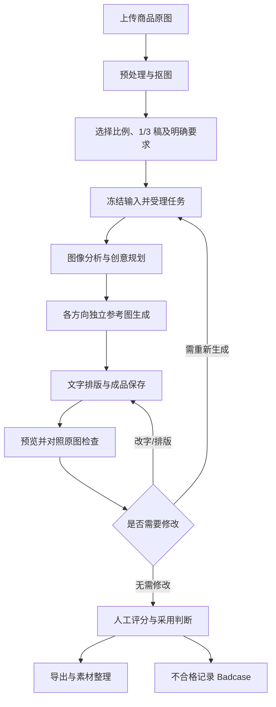
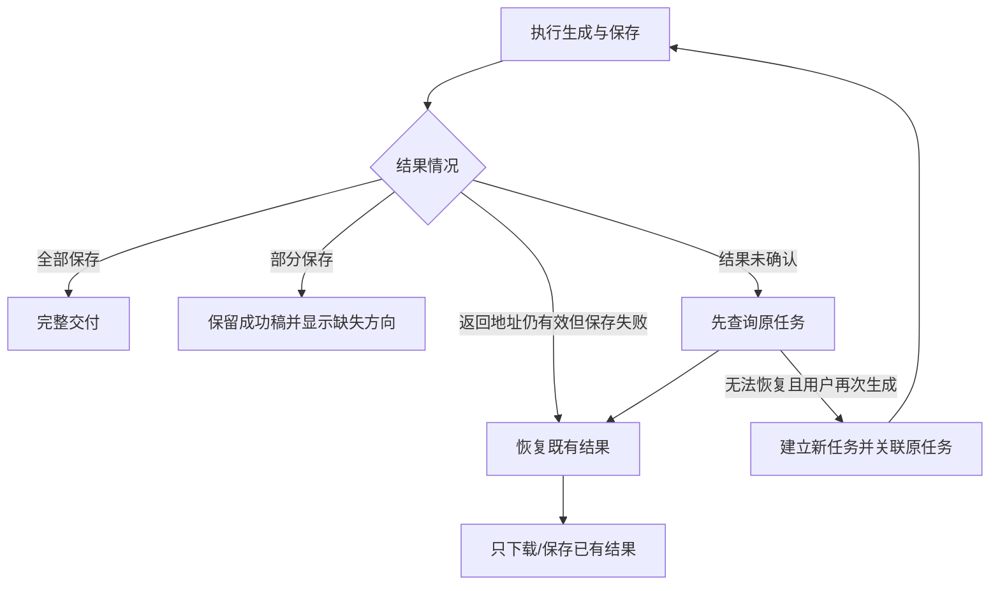
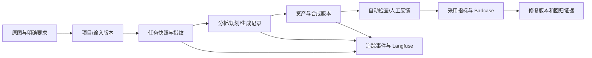
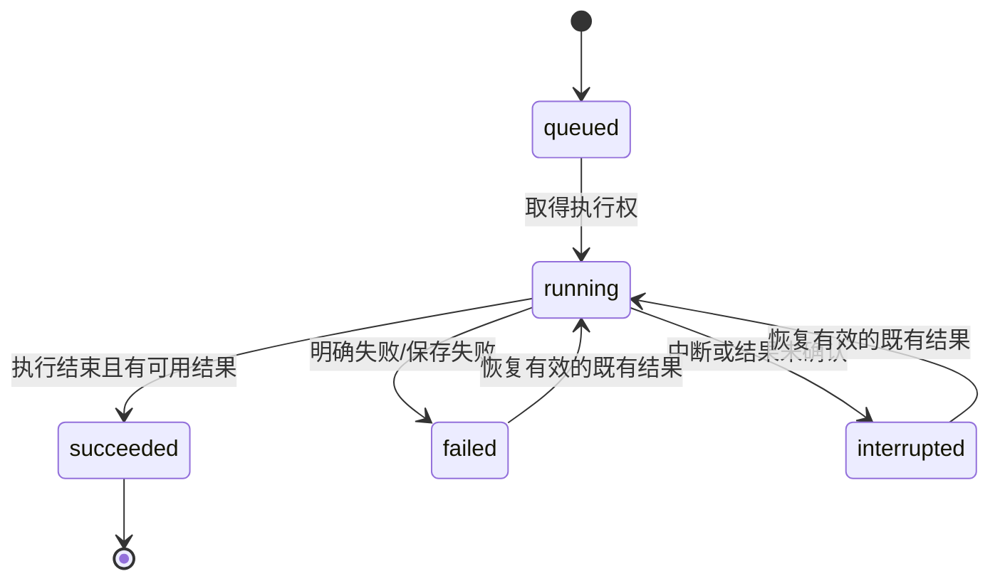

# 造物营｜需求规格说明书

**PRD V1.0 · 完整评审稿 · 2026-10-01**

| 文档信息 | 内容 |
| --- | --- |
| 产品名称 | 造物营：AI 电商创意平台 |
| 文档用途 | 课程作业提交；产品、研发、设计与测试评审 |
| 本期重点 | PC 图片创作、商品保真、AI 规则、质量评测与验收 |
| 文档负责人 | 个人项目负责人，姓名待填写 [待确认 D01] |
| 需求/开发/测试责任 | 当前由项目负责人承担；正式评审签署人待填写 [待确认 D01] |
| 版本及状态 | V1.0 评审稿；尚未完成签署和商业质量验收 |
| 事实截止 | 2026-10-01；最近真实评测批次为 2026-09-30 |
| 技术基线 | 主产品 commit 487a7006；最近已验证线上发布为 V14 |
| 参考模板 | 老师提供的《5.29版本-需求规格-V1.0.docx》 |

本稿沿用老师模板的章节与模块写法。带“*”的章节均填写完整；无关的可选项单独标“不涉及”。“已实现”表示有代码或执行证据，“待验收”表示仍缺正式场景验证，“待修复”表示已有失败证据，“框架”表示只有入口或需求保存，“规划”表示本期不交付。

| 版本 | 日期 | 变更说明 | 责任人 |
| --- | --- | --- | --- |
| V1.0 | 2026-10-01 | 按老师真实 PRD 模板汇总范围、图片流程、AI 策略、数据、评测、验收与作业证据；校正历史两稿输出和演算指标 | 项目负责人 |

<!-- TOC -->

# 1 功能清单

## 1.1 *需求背景

### 1.1.1 产品定位与问题

造物营面向电商商家、运营人员和设计师，组织商品资料、创意生成、素材加工与成果整理，帮助用户把商品图片转为可检查、可修改、可导出的经营素材。整体产品覆盖图片、页面、文案、视频、工具箱和字体六类能力；本期以图片创作闭环作为最小可交付业务单元。

用户需要完成的工作是“得到能使用的商品素材”。生成图片数量和模型评分只是过程信息；最终必须检查商品是否准确、要求是否满足、文件是否完整，以及人工修改是否在可接受范围内。

| 业务问题 | 使用者的具体困扰 | 本期回应 |
| --- | --- | --- |
| 资料散 | 原图、卖点和活动信息反复寻找，容易引用旧版 | 一个项目保存原图、设置和版本；生成时冻结输入 |
| 复用慢 | 每次换图都重复抠图、配背景、排字和调尺寸 | 自动预处理、三种创意方向、文字修改与再次合成 |
| 创意难 | 同一商品候选过于相似，难以比较 | 场景、棚拍、图形三个独立创意，分别生成 |
| 返工勤 | 主体裁切、中文断行、低对比等问题反复出现 | 明确质量门槛，记录 Badcase，固定证据回归 |
| 生不准 | AI 增加商品或道具、改变数量和包装，文字超出事实 | 原图与明确要求优先；区分事实、视觉推断与创意描述 |

以上是已有项目材料提出的问题假设，尚未有量化用户调研。访谈、竞品市场规模与用户付费意愿不作为已验证结论。

### 1.1.2 目标用户与场景

| 用户 | 主要任务 | 采用条件 |
| --- | --- | --- |
| 中小商家/店铺运营 | 上新、日常更新、活动素材准备 | 操作少、商品准确、费用与失败状态清楚 |
| 电商设计师 | 商品视觉制作与修订 | 主体保真、版式可控、原图和底图可复用 |
| 内容/营销运营 | 围绕商品持续准备主题与创意 | 候选有实质差异，图文事实一致，成果可整理 |

新品上架需要把原图转为商品主图或场景图；日常经营需要同一商品的不同主题表达；活动与投放需要多个创意及规格。本期以单项目、单次输入图、1 或 3 个方向实现上述场景中的图片部分。完整详情页、商品笔记、活动多 SKU 批量与短视频仍在后续范围，不能把流程愿景写成当前交付。

### 1.1.3 业务目标与衡量

| 目标 | 指标与判断方法 | 当前基线/目标性质 |
| --- | --- | --- |
| 稳定交付完整图片组 | 完整交付逻辑任务数 / 正向受理任务数 | 真实批次 9/10；本期每个修复回归场景必须达到约定数量 |
| 提升可用素材供给 | 生产环境首次有合格且被采用素材的每周去重任务数 | 正式人工记录为 0，未形成采用基线 |
| 减少修订 | 合格采用素材的修改等级、分钟数；与同条件人工流程比较 | 尚未测；首轮采用率与提效目标待确认 D02 |
| 控制真实消耗 | 总实际成本 / 合格采用逻辑任务数 | 账单与采用分母不足，单位成本为“未测” |
| 能解释并验证问题 | 每个 Badcase 有输入、首个偏离、证据、归因、修复与回归记录 | 5 条调查中；回归记录为 0 |

目标采用率、提效百分比与预算上限是试点决策，按 D02、D03 确认后填入。任何算例均不得进入真实基线。

## 1.2 *功能清单

### 1.2.1 原需求与本期功能

优先级定义：P0 为商品准确、数据安全和核心交付；P1 为质量、可用性与管理；P2 为后续扩展。优先级与完成状态分开记录。

| 需求 | 用户可观察结果 | 本期映射与边界 |
| --- | --- | --- |
| R01 商品资料复用 | 同商品资料能重复用于创作 | F01/F07 原图、设置与项目复用；统一商品资料库/链接解析规划 |
| R02 任务化创作入口 | 明确需要什么产物 | F02/F03 图片入口；跨工具业务任务编排规划 |
| R03 商品与场景创作 | 商品准确，创意可比较 | F03/F04/F09；当前有商品裁切与新增水果问题 |
| R04 多用途文案 | 表达可生成、选择和修改 | F05 文字修改、标题文案可用；导购入口框架 |
| R05 完整图文页面 | 图文组织为页面 | 商品笔记、商详长图、创意卡片为框架 |
| R06 商品动态内容 | 视频预览与确认 | 图生视频、即刻成片为框架 |
| R07 局部加工与适配 | 抠图、改尺寸、标题视觉 | F01/F05/F06；创意字为框架 |
| R08 修改与素材整理 | 版本可辨认，可复用导出 | F05/F06/F07/F08/F11 |
| R09 状态与消耗 | 知道交付、错误和调用状态 | F08/F09/F13/F15；准确人民币成本待账单 |

| 编号 | 功能 | 优先级 | 当前状态 |
| --- | --- | --- | --- |
| F01 | 图片上传、原图保留、自动抠图与回退 | P0 | 已实现；复杂透明/多主体需人工检查 |
| F02 | 品类、方向、数量、比例与自定义要求 | P0 | 已实现；跨端字符计数一致性待验收 |
| F03 | 图片理解与 1/3 个独立创意生成 | P0 | 已实现；实测有 1 组部分交付 |
| F04 | 商品保真与背景硬约束 | P0 | 待修复：BC02 主体裁切、BC03 新增水果 |
| F05 | 文字编辑、版式合成与可读性 | P1 | 编辑已实现；BC04/BC05 待修复 |
| F06 | 按规格保存、预览、导出 | P0 | 本机保存实测；浏览器实际下载闭环待验收 |
| F07 | 项目、素材、草稿、冲突与回收站 | P0 | 已实现；完整多端场景待验收 |
| F08 | 任务状态、部分交付、恢复与重试 | P0 | 已实现；真实存储故障恢复和重试去重待验收 |
| F09 | AI 规则、模型与提示词版本追踪 | P0 | 已实现记录；硬约束结果核验待补齐 |
| F10 | 自动规则检查、人工评分、采用 | P0 | 已实现入口；正式视觉人工记录 0 |
| F11 | Badcase 调查与证据回归关闭 | P1 | 已实现入口；5 条调查中，回归 0 |
| F12 | 评估器结果人工复核与历史导出 | P1 | 本机配套工具已实现；12 条待实际复核 |
| F13 | 指标、埋点与环境隔离 | P1 | 已实现部分；真实采用/成本基线待建立 |
| F14 | 批量评测与回放证据 | P1 | 首轮 A 已执行；真实版本 B 未执行 |
| F15 | Langfuse 追踪同步 | P1 | 历史回填已读回；运行自动导出与线上链路待验收 |
| F16 | 其他工具入口与需求草稿 | P2 | 5 个可用入口、7 个框架入口；不承诺全平台闭环 |

### 1.2.2 全平台入口状态

| 类别 | 入口 | 本期能力边界 |
| --- | --- | --- |
| 图片 | 图片创作、商品场景图 | 可用；本 PRD 详述图片创作主流程 |
| 文案 | 标题文案 | 可用；依据已确认事实提供候选，用户选择 |
| 工具箱 | 尺寸适配、智能抠图 | 可用；加工与规格处理 |
| 页面 | 商品笔记、商详长图、创意卡片 | 框架：可保存需求，不生成真实页面 |
| 文案 | 导购文案 | 框架 |
| 视频 | 图生视频、即刻成片 | 框架 |
| 字体 | 创意字 | 框架 |

框架入口允许填写不超过 1500 字的需求、选择形式和 1/2/4 数量并保存在浏览器 IndexedDB；预览须明确为示意，不产生模型调用和采用计数。入口数量和图片主流程的 1/3 稿设置是两套独立规则。

本期不包含移动端、证件照、AI 图标；不承诺自动发布、广告投放、转化归因、商品链接解析、多人审批、批量多 SKU 或付费套餐。规划功能须另立需求与验收。

# 2 角色清单与事权

## 2.1 系统角色清单

| 角色 | 工作职责 | 系统落地 |
| --- | --- | --- |
| 创作者 | 准备原图和明确要求，选择并修改素材 | 当前登录账户可操作自己的工作区 |
| 审核者 | 对照原图评分、判定采用、复核 AI 结论 | 同一账户可承担；未建立独立团队审核权限 |
| 项目维护者 | 配置评测、分析 Badcase、管理版本 | 当前项目负责人；平台密钥在服务端配置 |
| AI 服务 | 理解图像并生成视觉候选 | 提供建议和生成结果，无权确认商品事实或业务采用 |
| 渠道负责人 | 负责发布、投放及效果回填 | 产品外业务分工，当前无自动发布权限 |

前三项是业务责任分工，当前系统授权以账户所有权为准。多人 RBAC 与审批流不作为已完成功能 [待确认 D06]。

## 2.2 系统角色事权矩阵

| 操作 | 当前账户 | 其他账户 | AI 服务 | 规则 |
| --- | --- | --- | --- | --- |
| 查看/编辑项目与原图 | 允许 | 禁止 | 仅接收任务必要输入 | 服务端校验 owner；越权不暴露资产存在性 |
| 发起生成/恢复 | 允许 | 禁止 | 执行平台请求 | 额度、状态、输入版本均需有效 |
| 修改文字/导出 | 允许 | 禁止 | 无确认权 | 修改产生新资产版本，旧反馈不得直接沿用 |
| 人工评分/采用 | 允许 | 禁止 | 仅建议 | 必须满足规则及当前版本要求 |
| Badcase 分析/关闭 | 允许 | 禁止 | 可辅助归因 | 关闭必须具有合格回归证据 |
| 配置供应商密钥 | 平台维护者操作 | 禁止 | 不返回密钥 | 不要求终端用户填写密钥 |
| 评估器人工复核 | 配套工具任务所属账户 | 禁止 | 原始判分保留 | 复核历史追加，不覆盖原分数 |

# 3 业务流程

## 3.1 图片创作主流程

用户故事：作为商家运营，我希望上传一张真实商品图，得到三种可比较的创意，并能改字、检查、保存和下载，以完成一次商品素材交付。

前置条件：已登录；有合法可用的商品图；平台图像能力、存储和额度可用。后置条件：原图与设置保留；每份成品可追溯到任务和资产版本；采用记录有人工依据。

生成、保存、视觉合格、采用与下载是不同节点。任务执行结束不自动证明素材合格；模型得分不自动触发采用。

## 3.2 异常、恢复与部分交付

必须把已获得的素材展示给用户，不因一稿失败丢弃全组。再次生成可能产生新费用，需在操作前说明。恢复已有结果不得再次调用图像生成；未确认状态优先查询任务和供应商证据，不盲目重试。

## 3.3 数据流与追踪

逻辑任务 taskId 聚合原尝试和关联重试，jobId 标识一次执行，assetId＋version 标识具体成品。输入指纹不能替代 taskId 的业务去重；模型、规则或输入变更必须保留版本，不把不同比较条件合并成同一次回归。

## 3.4 状态机

业务交付状态独立计算：savedCount＝requestedCount 为完整交付，0＜savedCount＜requestedCount 为部分交付，savedCount＝0 为未交付。现有 succeeded 可能伴随部分候选失败，界面必须同时显示“2/3 已保存”和失败方向。

资产状态依次为待检查、合格/不合格、采用/未采用；改字或重合成后新版本回到待检查。Badcase 状态为 open、investigating、closed；closed 只由合格证据回归产生，失败回归继续调查。

# 4 图片创作工作台

## 4.1 *功能描述

提供从商品图到完整成品组的集中工作台。用户无需编写专业提示词即可采用默认配置，也可指定背景、文字和版式。保留所有原始输入、成功结果与修改版本，支持中断后的结果查找。

本模块覆盖 F01–F06。主要输入为一张商品图和创作设置；主要输出为 1 或 3 张 1080 像素规格成品、对应底图、任务记录及错误信息。

## 4.2 功能细项

| 细项 | 行为与结果 | 约束与验收 |
| --- | --- | --- |
| 上传 | 接收 PNG/JPG/WebP，保存原图并预览 | 前端单图不超过 8 MB；格式/内容不符应拦截 |
| 预处理 | 自动抠图；透明图可直接使用 | 抠图失败允许重试或使用原图，明确当前选择 |
| 默认创作 | 默认三稿、自动品类、方形 | 三稿分别是场景/棚拍/图形，各自独立生成 |
| 自定义 | 可分别控制背景、文案和版式 | 开关关闭时忽略该项；开关打开时按用户明确输入处理 |
| 生成 | 冻结输入、显示各阶段和每稿结果 | 重复同一请求不多扣次数；1/3 数量校验 |
| 预览/修改 | 选择成品，修改标题副标题后重新合成 | 文字合成不产生新的模型调用，资产版本更新 |
| 下载 | 下载当前确认的规格和版本 | 发起下载有记录；重新打开后的可下载性需独立验收 |

### 4.2.1 原图与抠图

首次抠图需在浏览器加载约 16 MB 的模型资源，显示加载与处理状态。成功后保留原图与处理图，不可只保存抠图结果。透明包装、玻璃、细线、多商品重叠可能被误处理；用户应能使用原图继续，不能把抠图失败视为商品缺失。

清空或替换原图后，旧商品的合成、审核和导出确认状态应失效；旧任务证据保留。原图不清楚时提示重新上传，不得凭模型补全商品规格。

### 4.2.2 三稿与单稿

三稿默认 scene、studio、graphic 三种意图。候选差异须体现真实场景、构图、色彩或信息层级至少两项变化，仅换标题、字号或套同一张底图不满足组内差异要求。

单稿允许指定自动/场景/棚拍/图形。当前单稿自动使用首个场景方向，不表示已经实现“自动择优选方向”。历史两个版式、同一背景的旧任务保留兼容显示，不能进入本期三稿完整率分母。

## 4.3 触发

| 触发动作 | 前置检查 | 后续动作 |
| --- | --- | --- |
| 上传/拖入文件 | 类型、体积、可读性 | 原图预览、预处理、保存草稿 |
| 点击生成 | 原图存在、设置有效、项目未删除、额度/并发允许 | 创建带输入快照的任务，锁定本次设置 |
| 点击修改文字 | 有保存成品和原底图 | 当前资产重新合成并形成新版本 |
| 点击恢复 | 任务为失败/中断且返回地址可恢复 | 尝试保存现有结果，不重新生图 |
| 点击再次生成 | 已确认是否可恢复，输入及额度有效 | 新 jobId，关联 taskId 与原尝试，说明新调用 |
| 点击导出 | 当前版本文件可读 | 浏览器发起下载并记录请求 |

## 4.4 界面

### 4.4.1 页面结构

页面按原图/设置、创作状态、候选成品、编辑与导出组织。设置区呈现品类、比例、稿数和自定义开关；结果区逐稿显示缩略图、方向、保存状态和错误。用户能直接回到已有项目，不必重复上传。

界面示意仅表达信息组织，实际 UI 以当前 PC 工作台为准。平台密钥、提示词日志及调试信息进入维护/评测区域，不作为商家日常必填项。

### 4.4.2 设置字段

| 字段 | 类型/默认 | 可选值与校验 | 编辑规则 |
| --- | --- | --- | --- |
| productImage | 图片/空 | PNG/JPG/WebP；前端≤8 MB | 生成前必填，可替换 |
| category | 枚举/auto | auto、food、electronics、apparel、home、general | 用户指定优先；auto 低置信度回退 general |
| conceptCount | 整数/3 | 仅 1 或 3 | 本次受理后冻结 |
| direction | 枚举/auto | auto、scene、studio、graphic | 单稿选择；三稿使用三方向 |
| ratio | 枚举/square | square 1:1；portrait 3:4 | 输出为 1080×1080 / 1080×1440 |
| customBackground | 布尔/false | 开启后读取 backgroundPrompt | 独立于文案与版式开关 |
| backgroundPrompt | 文本/空 | ≤500 个 Unicode 码点 | 明确禁止/要求应写入计划及核验 |
| customCopy | 布尔/false | false 自动生成；true 按用户输入 | true＋空文字＝明确不叠加文案 |
| title | 文本/空 | ≤18 个 Unicode 码点 | 不能修改商品包装原有文字 |
| subtitle | 文本/空 | ≤40 个 Unicode 码点 | 与标题分别校验 |
| customLayout | 布尔/false | 开启后使用 layout | 未开启时 AI 可推荐布局 |
| layout | 枚举/center | 手动仅 center、right | AI 自动还可能使用 left |
| visualVersion | 整数/2 | 本期只接收 2 | 内部策略字段，不在商家界面必填 |

服务端按 Unicode 码点计数，且先判断原始长度再 trim。前端 maxlength 的 UTF-16 计数可能与 emoji 不一致，TC03 须验证并统一提示；不能把 18 个汉字等同于任意 18 个显示字符。

### 4.4.3 状态、空态与错误

| 情况 | 用户可观察结果 | 系统动作 |
| --- | --- | --- |
| 没有原图 | 提示上传商品图 | IMAGE_REQUIRED；0 次生成调用 |
| 格式/长度无效 | 指出对应字段与上限 | INVALID_IMAGE/INVALID_QUICK_SETTINGS；不发起付费生成 |
| 服务未配置/额度用尽 | 显示当前不可生成原因 | 保留草稿，不要求用户提供平台密钥 |
| 三稿中一稿失败 | 展示已保存两稿及失败方向 | 部分交付，保留执行与错误记录 |
| 结果未确认 | 显示查询/恢复入口与可能消耗 | 不将其标为“零费用失败” |
| 保存失败 | 告知模型可能已完成，提供恢复 | 有效返回地址优先恢复保存 |
| 预览加载失败 | 提示重新加载；下载状态不可凭空认定 | 记录 result_load_failed |
| 文字无内容 | 显示无叠加文案的成品 | 原图包装字仍保留，不作空白图判定 |

### 4.4.4 文字合成与商品保真

生成策略 reference_scene_edit 的返回画面已经含商品；合成时不能再次叠加抠图造成双主体。旧 locked_product_composite 策略保留锁定商品层；不同策略以任务快照区分。

商品不可裁掉关键轮廓、包装标签或数量。返回图尺寸与目标比例不匹配时，先校验商品安全区域，采用留白/背景扩展等不裁主体方案；若无法完成，显示失败或待处理，不把裁切图作为合格结果。该项为 BC02 的修复要求，当前 cover 裁切尚未满足。

文字不得遮挡商品关键部位、溢出画布或出现中文逗号/句号位于行首、孤立尾字。文字和底图的局部对比必须可读；平均亮度检查不足时，可改变颜色、位置或增加衬底。对应 BC04/BC05 待修复。

### 4.4.5 用户行为分析与互联网搜索

分析上传完成、生成受理、阶段结束、实际可见预览、编辑合成、反馈与下载请求；事件口径见 7.6。仅请求了图片地址不计为用户看见结果。

互联网搜索需求：

不涉及

## 4.5 计算公式和案例

完整交付率＝保存全部约定成品的正向逻辑任务数 / 正向受理逻辑任务数。成品保存率＝实际保存成品数 / 正向任务约定成品数。缺图、超长字段等预期拦截用例单列，不进入正向交付分母。

真实批次要求 10×3＝30 张，9 个完整任务＋1 个只保存 2 张的任务：完整交付率 9/10＝90%，成品保存率 29/30＝96.7%。已保存文件的自动检查 29/29 通过，只证明文件规则，不证明三组商品保真或实际采用。

例如 C02 有两张保存成品，其终态可能为 succeeded，但业务交付必须显示 2/3；缺失方向不得因任务结束而计为已完成。

## 4.6 基表

### 4.6.1 基础数据

保存原图/处理图引用、项目版本、设置、任务 ID、逻辑任务 ID、输入指纹、模型/提示词/规则版本、逐方向生成结果、返回尺寸、成品尺寸、合成版本、资产 ID 和错误。完整字段见第 8 章。

### 4.6.2 业务规则

输入无效不调用生成；明确要求优先；三稿独立生成；成功稿保留；改字不重新调用模型；合格采用由当前版本的自动检查和人工评分共同判定；未知费用必须标未知。

### 4.6.3 样张模板

1:1 样张为 1080×1080，3:4 样张为 1080×1440。scene 表达商品使用情境，studio 强调商品与光影，graphic 强调图形色彩和信息层级。模板是视觉起点，商品轮廓和明确限制始终优先。

# 5 素材与任务管理

## 5.1 *功能描述

F07/F08 支持项目列表、草稿、原图/底图/成品、任务历史、回收站和数据备份。云端 D1 保存项目与任务元数据，R2 保存图片；IndexedDB 保存本机缓存与尚未同步的草稿。用户能够识别当前版本、未同步状态和冲突。

用户故事：作为设计师，我希望重新打开项目仍能找到原图、成功成品和设置，并在修改或同步冲突时保留自己的内容。

## 5.2 功能细项

| 细项 | 行为 | 前后条件与异常 |
| --- | --- | --- |
| 项目保存 | 原图、设置、修改内容保存到所属工作区 | 写入携带 expectedVersion；成功返回新的 serverVersion |
| 本机草稿 | 无网时保留当前操作并提示待同步 | 云端不可用不把本机草稿标为已云保存 |
| 冲突处理 | 不静默覆盖远端版本 | 保留冲突副本，用户比较后决定 |
| 原始素材复用 | 保留原图、底图与历史成品 | 重开/改字复用已有资产，不增加模型调用 |
| 软删除/恢复 | 项目进入回收站，可撤销恢复 | 删除版本冲突不得覆盖其他修改；活动任务不得写入已删除项目 |
| 任务查看 | 显示最近 60 次生成与各稿结果 | 此列表不是全历史指标的统计范围 |
| 结果恢复 | 有效待保存地址可重新下载保存 | 仅失败/中断、已有地址且未过有效窗；不再次生成 |
| 备份/导入 | JSON 包含图片与项目资料 | 文件≤40 MB、≤100 个项目；恢复为新 ID 并重新检查 |

数据永久删除及保存期限不是已确定政策，见 D04。本机 JSON 备份不是云端运维备份的验收证据。

## 5.3 触发

创建/编辑项目触发草稿保存与同步；登录/重开触发读取所属项目；云端版本不一致触发冲突流程；删除、撤销与恢复均作为带版本的写操作。任务运行和恢复前检查项目仍存在且未删除。

## 5.4 界面

### 5.4.1 项目与素材列表

列表展示项目名、原图、更新时间、当前设置及是否待同步。项目详情区展示任务、逐稿预览、当前资产版本、采用/待处理情况与错误。旧任务仅供追溯；当前输入变更后不能直接沿用旧审核。

### 5.4.2 任务与恢复字段

| 字段 | 类型/默认 | 校验/显示要求 |
| --- | --- | --- |
| taskId/jobId | 标识/受理时生成 | 分别表示逻辑任务和执行尝试，不混用 |
| sourceRevision/serverVersion | 整数/快照 | 输入版本变更需创建新快照 |
| requestedCount/savedCount | 1 或 3 / 实际保存数 | 逐稿结果支持部分交付 |
| status | queued/running/succeeded/failed/interrupted | 与完整/部分/未交付并列显示 |
| pendingImage | 地址及创建时间/可为空 | 仅在允许恢复的状态使用，不作为永久资产 |
| assetVersion | 正整数/当前版本 | 改字与重合成后更新；反馈须绑定版本 |
| deletedAt | 时间/空 | 非空项目不允许生成或写资产 |
| syncState | 本机同步状态 | 待同步、冲突与已同步能区分 |

现有恢复窗口为返回地址创建后 24 小时内；实际供应商地址可能提前失效。过期、重定向不可信或图片无效时停止恢复，保留原错误；再次生成另记新调用。

### 5.4.3 状态提示

保存失败说明本机/云端各自状态；版本冲突说明远端有更新；删除冲突要求重新读取；离开页面可能影响客户端驱动的执行。当前并非脱离浏览器独立运行的持久后台队列，不能承诺关闭页面后所有候选自动完成。

### 5.4.4 用户行为分析与互联网搜索

记录保存、恢复、删除、重新生成和导出，并区分离线操作与服务端受理。新增细分事件须标明版本再接入，不能用界面点击替代服务端写入成功。

互联网搜索需求：

不涉及

## 5.5 计算公式和案例

重试 attempts 是执行成本口径，logical task 是业务采用口径。同一任务第一次只保存 2 张、用户再次生成后得到 3 张，应保留两次执行消耗；在采用指标中按逻辑任务去重。第一次交付是否合格仍按首次尝试计算，不能事后回填成一次成功。

仅恢复已生成结果时，新增图像生成调用数必须为 0。恢复请求可以失败，其错误、次数与耗时需留档，不能用“恢复不生图”推导“恢复必然成功”。

## 5.6 基表

基础数据：projects、generation_jobs、creative_assets、workspace_events、原图/底图/成品 R2 引用、本机缓存版本。业务规则：所属账户隔离、CAS 版本写入、逻辑任务关联、成功素材保留、恢复与付费重试分开。

样张模板：项目详情包含原图、逐稿结果、版本、当前检查与导出状态；备份包包含创建版本和内容，导入后新项目需要重新检查。多人共享资料、跨账户素材传递和审批模板本期不涉及。

# 6 AI 创意策略需求

## 6.1 *功能描述

F09 将图片理解、创意规划、参考图生成与前端合成拆成可追踪步骤。AI 负责提出和实现视觉方案；商品真实性、明确约束、文件交付与业务采用由规则和人工审核共同控制。

策略优先级：原始商品与已确认事实、用户硬约束优先于品类配方及 AI 视觉建议。不能因为“画面更好看”增加商品数量、改变包装、编造卖点或违反“禁止新增水果”等要求。

## 6.2 功能细项与 Agent 输入输出

### 6.2.1 Step 1：图像理解

输入为原图、品类设置、目标比例及用户要求；输出商品视觉描述、品类和置信度、主体/背景关系、可能需要人工确认的内容。本批追踪到的分析模型为 qwen3-vl-plus；具体运行模型以每个任务记录为准。

| 要素 | 形式 | 来源 | 约束 |
| --- | --- | --- | --- |
| 原始商品图 | 图片引用 | 用户上传/已有项目 | 保留原图和哈希，不以重绘图替代事实源 |
| 品类 | 枚举 | 用户选择/视觉分析 | auto 且置信度≥0.7 才采用识别品类，否则 general |
| 商品数量/轮廓 | 可见描述 | 图像内容 | 不清楚时标不确定，不自动补充 |
| 包装可见文字 | 观察与证据 | 图像内容 | 小字不清晰不能当已确认成分、规格或认证 |
| 明确要求 | 文字 | 用户输入 | 原文入快照；禁止项不得被配方覆盖 |

自动品类路由只用于选视觉风格，不能证明商品功能、材质、口味或认证。食品图像识别成“清爽”不等于确认“低糖”。

### 6.2.2 Step 2：创意规划

默认构建 scene、studio、graphic 三个方案。各方案包含意图、背景、构图、光线、色彩、文案和版式，同时携带正向约束、禁止项和商品保真要求。

| 要素 | 形式 | 来源 | 约束 |
| --- | --- | --- | --- |
| conceptId/type | 标识/枚举 | 系统预设 | 三稿方向各一；单稿按选择 |
| background/light/palette | 视觉方案 | 品类配方＋模型 | 服从用户硬约束和商品识别度 |
| title/subtitle | 文本 | 用户输入/自动创意 | 自定义优先；不得编造价格、参数或效果 |
| layout/font | 枚举/样式 | 用户设置/规划 | 手动只 center/right；避免遮挡关键商品 |
| constraints | 明确要求与禁止项 | 原始输入 | 必须进入生成提示词，并在结果核验 |
| provenance / version | 来源及版本 | 服务端 | 记录模型、规则、提示词和规划结果 |

[待修复] 当前将限制写入规划不等于结果已遵守。BC03 证明“禁止新增水果”仍可能被模型违反，必须补充输出核验与人工检查入口。

### 6.2.3 Step 3：参考图生成

各方向分别调用真实参考图编辑。任务受理时冻结模型，不在失败后悄悄切换模型或删除约束。保存每次请求、响应、耗时、用量、供应商错误、返回图地址、图像尺寸和后续保存情况。

返回地址只作为中间结果；下载、类型/尺寸检查和资产持久化成功后才计为已保存。若一稿失败，保留其他稿；自动新增付费重试不是本期默认行为。

### 6.2.4 Step 4：合成、校验与交付

按 frozen workflow 选择商品层策略，生成统一尺寸成品，完成自动文件检查。对主体裁切、包装数量、背景禁止项、中文排版和局部对比增加检查要求；当前自动检查尚未覆盖全部语义，正式视觉合格由 7.4 人工规则判断。

| 输出 | 类型 | 成功条件 | 失败处理 |
| --- | --- | --- | --- |
| 规划结果 | 结构化方案 | 枚举、长度、方向数有效 | 结构无效时回退安全通用方案或明确失败，不伪造完成 |
| providerImage | 原返回图 | 可下载且内容有效 | 保存错误/待恢复地址；记录尺寸偏差 |
| composition | PNG 成品 | 约定尺寸、文件可读、保存可重开 | 无法保存不计入成品数 |
| ruleReport | 规则报告 | 绑定 job/asset/version | 报告缺失不能当规则通过 |
| executionTrace | 阶段记录 | 有版本、起止时间、结果/错误 | 追踪同步失败不抹去业务执行记录 |

### 6.2.5 事实与文案规则

当前图片主流程允许仅上传图片，不能强制把历史“事实卡”设为所有图片任务的前置条件。默认自动文案可以使用不宣称商品参数的创意短语；涉及价格、成分、功效、认证、折扣、活动时间等，必须来自用户确认的资料。

已有标题文案分支使用已确认名称、卖点和活动资料，给出 3 个 1–18 字候选，由用户选择后应用。未采用的 AI 建议不写回商品事实。旧字段 productName≤30、sellingPoint≤60、campaign≤18、headline≤18、price/originalPrice≤20、日期字段≤10 属于旧资料/文案分支，不替代新图片设置的规则。

不确定内容须让用户补充或删除相关事实表达。现有纯图片流程尚未验证完整澄清问答，因此将其列为后续设计；本期通过保守文案、原图对照和人工门槛避免把推断写成事实。

### 6.2.6 冲突、注入与降级

用户需求或图片内文字是任务数据，不能改变系统授权、要求泄露密钥、越权读资产或关闭规则。模型 JSON 必须经枚举/长度/结构校验后使用；不执行输出中的代码、外链命令或权限指令。

自定义背景与默认水果/道具配方冲突时，用户明确禁止项优先。低置信度品类回退 general；无法保真时提示处理，不输出假定合格的图片。断网/供应商不可用保留任务和已保存结果，不用示意图替代付费生成结果。

## 6.3 触发

生成受理触发图像分析和规划；每个冻结的方向触发独立生成；保存底图后触发合成和检查。改字只触发重新合成；恢复只触发已有结果下载/保存。规则、提示词、模型或布局实现变化后，对受影响用例发起新版本回归。

## 6.4 界面

创作者看到当前阶段、方向、候选、明确错误与恢复/再次生成动作。质量中心看到规划约束、返回图、最终成品、阶段耗时、用量、错误和版本。不得把供应商 API key、内部授权信息显示给终端用户。

用户行为分析记录生成受理、分析、方向生成、合成、保存与检查；互联网搜索需求：

不涉及

## 6.5 计算公式和案例

三稿的一次正向任务预留 3 次图像生成尝试额度，单稿预留 1 次；分析调用另有用量和成本记录。次数额度采用 UTC 日期，业务周指标采用北京时间，两者不能使用同一边界计算。

案例：C06 请求 3:4 结果，供应商请求为 1024×1536，但 graphic 实际返回 1491×1055，合成后 1080×1440。输出尺寸正确不代表商品完整；需要同时核验返回比例、裁切策略和主体安全区域。

## 6.6 基表

基础数据为原图哈希、输入指纹、任务/尝试号、品类置信度、conceptId、计划、完整提示词快照或可追溯引用、模型、workflowVersion、规则版本、返回尺寸、usage、executionTrace。版本记录应支持复现实验，不把新提示词覆盖旧任务。

业务规则为“事实与硬约束优先、输出可核验、失败可追踪、恢复不重新生图、模型建议不自动采用”。样张覆盖单/多商品、食品饮料、透明包装、空文案、中文断行、竖图比例与禁止道具；其他品类覆盖待补 E06。

# 7 质量评测与数据需求

## 7.1 *功能描述

F10–F13 把执行稳定性、图像质量、评估器可靠性和业务采用分开评价。自动规则检查负责可确定的格式与状态；模型评估提供辅助判断；人工对照原图给出视觉评分和采用；Badcase 通过可复现证据定位问题。

| 评价层 | 回答的问题 | 证据与边界 |
| --- | --- | --- |
| 输入/文件/执行规则 | 是否按接口与交付契约运行 | 可由代码及真实任务证据验证，不能判商品保真 |
| 非视觉模型评估 | 执行与文本证据是否符合规则 | 当前评估器未收到图像像素，不评价裁切/光影/版式 |
| 视觉质量与人工采用 | 商品与要求是否准确，素材能否用 | 原图＋底图＋成品＋人工评分；AI 预审不能替代 |
| 业务效率与成本 | 采用是否减少工作或费用 | 真实采用、修订计时、人工对照及账单；尚未测 |

## 7.2 功能细项

| 细项 | 输入/结果 | 核心规则 |
| --- | --- | --- |
| 自动检查 | 保存资产→尺寸/格式/数量/文件状态报告 | 固定报告版本，缺报告不判通过 |
| 人工评分 | 原图/成品→三硬门槛、四维分、修改成本 | 绑定当前资产版本，说明判断依据 |
| 采用反馈 | 合格资产→采用/不采用 | 不满足质量条件不得写 adopted |
| 组内差异 | 完整方向组→差异判断 | 至少两项实质差异；不完整组单列 |
| Badcase | 自动失败或人工拒绝→问题记录 | 有阶段、原始证据、影响及假设 |
| 回归 | 同条件新结果/更高资产版本→通过或失败 | 新证据满足对应关闭规则，不能凭备注关闭 |
| 评估器复核 | 原始 AI 判分→人工判断及历史 | 原始分数不可覆盖，修正另记 |
| 指标 | 事件/质量/采用→生产或评测统计 | 所属账户、环境、时间、任务去重一致 |

## 7.3 触发

成品保存触发自动检查与资产登记；用户选择素材触发原图对照与评分；拒绝或执行失败触发 Badcase；规则/实现修复后触发回归；采用/撤销采用或资产版本变化触发指标重算。配套评测工具中的人工复核只更新复核记录，不自动改写造物营的视觉采用或关闭 Badcase。

## 7.4 界面与人工判定规则

### 7.4.1 产品质量中心

界面提供生产/内部评测/历史环境选择、任务/成品、规则与人工记录、Badcase 和回归。默认生产统计不混入 evaluation、legacy、mock。列表当前有数量上限，界面要说明范围，不把当前列表当所有历史。

审核者能同时看原图、模型返回图、成品、用户明确要求与版本。评分前检查当前资产未被修改，提交后追加记录，不覆盖旧版本判断。

### 7.4.2 三项硬门槛

| 门槛 | 通过条件 | 不通过示例 |
| --- | --- | --- |
| facts 商品事实 | 颜色、轮廓、数量、包装标识及关键可见事实与原图/确认资料一致 | 多一个商品、漏瓶盖、包装换字、把推断成分写为事实 |
| requirements 明确要求 | 指定比例/文案/背景/禁止项得到满足 | 禁止新增水果却出现半颗牛油果 |
| delivery 完整交付 | 约定数量、版本与文件可打开/保存/重开，规格正确 | 三稿只交两稿、错误版本、文件不可读取 |

门槛均为必填布尔值，不允许以“画面好看”抵消商品错误。文件检查与人工交付判断分层记录；对组不完整的任务不得通过完整组交付门槛。

### 7.4.3 四维评分与修改成本

| 维度 | 0 分：不可用 | 1 分：需小改 | 2 分：可直接用 |
| --- | --- | --- | --- |
| composition 构图 | 商品被裁切/遮挡，主体不清 | 主体完整但位置/留白需调整 | 主体突出，信息和留白合理 |
| style 风格 | 与商品/要求冲突，明显拼接 | 大体匹配但局部不协调 | 商品、背景与主题一致 |
| light 光影 | 明显漂浮、光源冲突、质感错误 | 局部阴影/边缘需调整 | 光线、接触影和质感自然 |
| text 文字 | 不可读、溢出、事实错误或严重断行 | 小幅排字/颜色调整 | 文案正确，断行和局部对比清晰 |

每项整数 0–2。editLevel 为 direct/minor/redo；editMinutes 为 0–600 的整数。minor 只有在修改不超过 10 分钟时才满足本期一次可用规则；redo 表示重做，不算一次可用。

合格 eligible＝三项硬门槛均真＋每项分≥1＋四维总分≥6/8＋editLevel≠redo＋editMinutes≤10。adopted 还要求当前资产自动检查通过和用户明确采用。规则版本跟随评分保存；“不需要文字”的素材按该需求判断排版，不因没有叠字机械扣分。

字段 note≤800 字、rejectionReason≤60 字。内容重复的同一反馈 ID 返回原成功结果；同 ID 不同内容、资产版本过期或不满足采用规则应返回冲突/规则错误，不能静默覆盖。

### 7.4.4 组内差异

scene、composition、palette、hierarchy 为差异轴。完整组至少在其中两轴有可辨认的实质差异，并与商品及本次需求一致。已有界面可对至少两张图片登记差异意见；三稿指标仅统计完整且完成组评审的三稿任务。

### 7.4.5 评估器人工复核

本机配套 Eval-Any-Agent 的结果页提供“人工复核”，可逐条或从待复核条目开始。展示原图、输出、原始分数/通过状态、理由、评估规则及历史。

| 字段/动作 | 规则 | 保存结果 |
| --- | --- | --- |
| 判对了/判错了/暂时无法判断 | 三选一 | 人工判断与复核时间 |
| 复核理由 | 必填 1–4000 字 | 说明图像/执行/文本证据 |
| 修正分数/通过状态 | 判错时可选，需符合量表 | 独立人工修正，不覆盖 AI 原始值 |
| 提交版本/幂等标识 | expectedVersion 与 idempotencyKey | 追加历史；冲突提示重新读取 |
| 图片证据 | 任务所属、允许的私有根路径、哈希校验 | 无证据标缺失，不冒充已看图 |
| 导出 | CSV/XLSX 含最新复核和历史 | 能区分原始判分与人工结论 |

正式 12 条结果尚无实际人工复核记录。该功能是评测器校准工具，不能代替产品中的 29 张视觉人工验收。

## 7.5 计算公式、指标与案例

### 7.5.1 指标字典

| 指标 | 口径/公式 | 排除或注意 |
| --- | --- | --- |
| 每周有效首次采用任务数 | 北京时间周一至周日，生产环境有当前合格资产首次被采用的 taskId 去重数 | 测试/历史/模拟不进入；撤销与新版本按规则重新判断 |
| 首次可用率 | 首次尝试有合格且被采用资产的正向 taskId / 正向受理 taskId | 技术失败保留分母；待人工审核数另列 |
| 完整交付率 | savedCount=requestedCount 的正向 taskId / 正向受理 taskId | 部分交付不计完整；边界测试单列 |
| 视觉合格率 | 合格的当前资产数 / 已完成人工审核的当前资产数 | 必须同时公布已评/未评数量；不能外推未评资产 |
| 组内差异通过率 | 完整且通过差异评审的组 / 已完成该项评审的完整组 | 两稿部分组不当三稿完整组 |
| 技术成功率 | 按独立 task 和交付契约统计的通过数 / 正向受理数 | 不用 HTTP 200 或终态 succeeded 代替完整交付 |
| 单位采用成本 | 该队列分析、生成、失败、重试及分摊存储实际费用 / 合格采用 taskId | 采用为 0 或账单缺失时返回未测/null，不填 0 元 |
| 合格交付耗时 | 从受理/准备到保存、必要人工修订与确认的时间 | 模型耗时与端到端耗时分别展示 |
| 提效比例 | (同条件人工有效工时－产品辅助有效工时) / 人工有效工时 | 成对样本、同质量要求；等待时间另列 |
| 评估器一致率 | 明确可判定且人工认同的 AI 结果数 / 明确可判定的复核数 | 无法判断单列；原始通过率和修正率分别报告 |

### 7.5.2 真实基线（版本 A）

批次 real-eval-20260930-v1，environment=evaluation，主产品 commit 487a7006。20 条历史 MOCK 经映射去重后形成 12 个独立真实用例：10 个正向生成、2 个边界检查。不是 20 次独立真实生成。

| 基线项目 | 实测结果 | 解释 |
| --- | --- | --- |
| 正向交付 | 9/10 完整，1/10 部分 | 完整率 90% |
| 成品 | 保存 29/30，生成尝试 30 | 保存率 96.7%；不等于采用率 |
| 分析 | 10 个正向任务均有分析与用量 | 成本需供应商账单校对 |
| 契约检查 | 11/12 用例；保存文件 29/29 检查通过 | C02 数量不足；文件通过不覆盖视觉 |
| 正向端到端耗时 | P50 102.844 秒，P95 188.320 秒，n=10 | 包括预处理/生成/保存/规则读取，P95 使用 nearest-rank |
| 非视觉评分 | 12 条判分成功，9 条通过/3 条未通过，均分 95.58 | 正向 7/10，边界 2/2；不是图片质量分 |
| 视觉预审 | 11 条 AI 预审，覆盖 10 个正向场景 | 不算人工验收 |
| 人工视觉/采用 | 正式人工质量记录 0；采用率未测 | 29 张待评，不能填“采用率 0%”或演算采用率 |
| 评估器人工复核 | 正式复核记录 0 | 12 条待复核 |
| Badcase/回归 | 5 条 investigating；回归 0 | 没有已修复或已关闭收益 |
| Langfuse | 历史回填 10 traces、157 observations、67 scores；224 条已发送并读回 | 运行自动导出及线上数据链路尚待验收 |

### 7.5.3 新评分的复核边界

评估器“执行与文本约束 · 非视觉评估 v1”使用 gpt-5.6-luna，任务 ID 为 cmunznt6d001zbxi8x06xa07u。

| 用例 | 原始评估 | 需复核的证据/处理 |
| --- | --- | --- |
| C02 | 87 分但未通过 | 缺 1 稿符合交付硬门槛失败，高分不覆盖门槛 |
| C08 | 80 分未通过，认为“爆珠”缺依据 | 原图可见“紫米爆珠”，评估器未收到像素；记录疑似误判并补证据，不直接改原分 |
| C09 | 80 分未通过，认为“果香与谷物”缺依据 | 原图可见“燕麦＋草莓”，需人工结合原要求判断措辞 |
| C06 | 100 分通过 | 仅证明执行与文本范围；裁切/水果两条视觉问题继续调查 |

重新评估必须使用新评估器版本并保留原结果，不能把补证后的分数回写成原次表现。

## 7.6 基表与埋点

### 7.6.1 基础数据与范围

资产检查、人工反馈、组内差异、Badcase 与回归分别存储，关联 ownerId、environment、taskId、jobId、assetId/version、createdAt 及规则版本。界面快捷“喜欢/不喜欢”与完整人工量表分开；快捷反馈不自动成为 eligible 证据。

质量中心生产与评测环境分开；当前 jobs 列表最近 60 条、Badcase 列表最多 200 条，计算汇总应声明真实查询范围。跨时区每周采用去重、撤销采用、资产更新和重复提交需要 E04 专门验证。

### 7.6.2 关键埋点

| 事件 | 触发与证明 | 必备属性/状态 |
| --- | --- | --- |
| product_input_started/ready/failed | 输入开始、可用或失败 | 项目、输入版本、环境、错误 |
| cutout_started/completed | 预处理开始/结束 | 原图标识、耗时、处理选择 |
| generation_accepted | 服务端受理成功 | task/job、指纹、稿数、模型、规则/工作流版本 |
| 分析/生成阶段追踪 | 阶段真实开始/完成/失败 | concept、span、耗时、usage、错误及返回尺寸 |
| composition_completed/asset_persisted | 合成结束/文件持久化成功 | 资产版本、尺寸、文件哈希/引用 |
| result_viewed/result_load_failed | 图片加载且可见/加载失败 | job/asset/version；未看见不计 viewed |
| asset_rule_checked | 当前资产检查结束 | 规则版本、通过情况、错误 |
| asset_feedback_saved | 人工反馈服务端保存成功 | 当前版本、硬门槛、评分、修改等级/时间、采用 |
| group_diversity_reviewed | 差异评审完成 | 完整组/实际数量、差异轴、结论 |
| retry_requested/recovery_requested | 再生成/已有结果恢复 | 父任务、尝试号、是否新增模型调用 |
| quick_export_requested | 向浏览器发起下载 | 当前版本、请求时间；不代表落盘/发布 |

原始图像和详细个人资料不在普通行为事件中重复存储。新增一般 PV/UV 或其他商业事件属于后续设计，不能宣称目前已实现。

### 7.6.3 Badcase 清单与闭环规则

| 编号 | 用例/等级 | 已观察问题与证据 | 修复方向/当前状态 |
| --- | --- | --- | --- |
| BC01 | C02 graphic / P1 | PROVIDER_UNAVAILABLE，耗时约 125.24 秒，三稿只保存两稿；缺供应商 status/requestId | 补上游证据，保留成功稿，核对后只重试失败方向；调查中 |
| BC02 | C06 graphic / P0 | 请求竖图，实际返回横图；最终竖图商品左侧被裁 | 校验返回比例与安全区，改为不裁商品的适配；调查中 |
| BC03 | C06 scene / P0 | 明确禁新增水果，实际多半颗牛油果 | 禁止项优先，取消冲突配方，增加输出核验；配方影响仍是待验证假设 |
| BC04 | C05 scene/graphic、C09 graphic / P1 | 中文逗号行首、尾行孤字 | 增加中文禁则与尾行控制，固定底图复合成；调查中 |
| BC05 | C03 studio / P1 | 局部浅背景上的白字低对比 | 按文字局部亮度判断，调色/位置/衬底；调查中 |

每条必须包含原始需求、预期、实际、用户影响、首个偏离步骤、可定位证据、已确认原因/假设、修复方案、版本和回归状态。不能把“供应商不可用”进一步猜成确定的 5xx/超时原因。

自动执行类关闭要求原失败阶段通过并完整交付；视觉/反馈类关闭要求新当前资产规则通过且人工合格采用。回归需同输入指纹、同模型和真实生产/评测环境；纯合成修复可使用原底图形成更高资产版本，并证明新增生成调用为 0。不同输入或模型只能作补充测试，不能作为同条件效果证明。

### 7.6.4 重点复盘样张：C06 商品裁切

原要求：同一商品三方向、3:4、保留完整主体。预期：商品轮廓完整，最终 1080×1440。实际：graphic 返回 1491×1055 横图，cover 放大填充竖图后商品左侧被切掉。

首个可观察偏离发生在供应商返回比例；产品随后未校验比例和主体安全区域，直接 cover 裁切，形成最终用户问题。因此归因分为“上游返回不符合请求比例”和“产品适配缺少防裁切检查”，不能只归咎模型。

修复：先保留原返回图，采用不裁主体的留白/扩展适配；无法完成时提示待处理。回归：固定原返回图与原需求，生成新合成版本，对照商品边缘，确认尺寸、文字、留白与文件检查；再测正常竖图和其他品类。当前修复未执行，回归记录为 0。

| 原始商品图 | 供应商 graphic 返回图 | 最终 graphic 成品 |
| --- | --- | --- |
|  |  |  |

证据样张见本批真实看板与 C06 目录。此案例可用于作业归因复盘；完成一个真实修复回归后再补入结果，不预写优化收益。

# 8 数据与接口需求

## 8.1 数据清单

本节字段为产品逻辑名；实际 DB 中 snake_case 与接口 camelCase 的映射由 schema/服务实现定义。主数据不得由任意客户端字段改写 owner。必填条件以受理或对应写入阶段为准。

| 对象 | 核心字段与类型 | 必填/关联与规则 |
| --- | --- | --- |
| projects | id/ownerId 字符串；serverVersion 整数；draftJson；createdAt/updatedAt 时间 | ID 与 owner 必填；保存校验 expectedVersion；draft 含输入、设置和 deletedAt |
| generation_jobs | id/projectId/taskId/parentJobId；attemptNo；kind/status；sourceRevision；inputJson/resultJson | 首次任务有 taskId，重试关联父尝试；快照不可用新设置覆盖 |
| 任务追踪属性 | inputFingerprint；environment；workflowVersion；provider/model；startedAt/finishedAt；errorCode/message；usage | 环境枚举隔离；未知费用/响应字段为 null 而非伪造 0 |
| creative_assets | id/jobId/ownerId；version/outputIndex/conceptId；image 引用及检查信息 | 同一版本和方向可追溯；修改产生新 version |
| asset_feedback | id/assetId/version；三门槛；四维分；editLevel/minutes；adopted；note/reason | 版本必填；不可变追加；采用需规则合格 |
| quality_reviews | id/jobId/assetId；kind；rubric/report；规则版本和时间 | auto/human 分开；报告不改原资产 |
| quality_badcases | id/owner/job/asset/version；stage/error；evidence；hypothesis/fix；status/version | investigation 描述与证据分开；关闭必须回归 |
| quality_regressions | id/badcaseId；输入/模型/新任务或新资产；proof/outcome/report | 回归新证据不可复用旧版本判断；记录 pass/fail |
| telemetry_events | id/owner/job/task；environment；name/stage/status/span；data/time | 事件 ID 幂等，同 ID 内容冲突拒绝 |
| daily_quota | owner/day/kind/used | UTC 日；是调用次数额度，非人民币预算 |
| workspace_events | id/project/revision/kind/payload/time | 记录 edit/review/export/adoption；导出只证明请求 |
| langfuse_exports | id/owner/job；state/attempt/error；导出内容引用 | pending/sent/失败分开；支持同一追踪幂等同步 |
| 配套 EvaluationReview | resultId/owner/expectedVersion；judgment/reason/corrections；idempotencyKey/time | 原评分独立，追加历史；不能自动当产品质量反馈 |

R2 使用账户命名空间及图片内容哈希；所有图像引用读取先检查所属与有效性。本机缓存和私有证据路径属于辅助存储，不作为跨账户共享协议。

## 8.2 接口清单与规范

### 8.2.1 当前主要接口

| 方法/路径 | 输入与返回用途 | 主要规则 |
| --- | --- | --- |
| GET /api/status | 功能、供应商、额度、时区与追踪状态 | 不返回密钥；未配置有明确状态 |
| GET /api/projects；GET/PUT /api/projects/{id} | 所属项目与版本化保存 | 写入 expectedVersion；冲突不覆盖 |
| POST /api/projects/{id}/trash | 删除/恢复 | 校验当前版本及归属 |
| GET /api/assets/{key} | 当前账户图片 | 私有缓存；类型校验；越权不返回内容 |
| GET/POST /api/jobs；GET /api/jobs/{id} | 最近任务、受理与任务查询 | 同请求 ID 幂等；输入与项目有效 |
| POST /api/jobs/{id}/run | 执行被冻结的任务 | 取执行权，阻止重复运行 |
| POST /api/jobs/{id}/recover | 恢复既有返回图 | 状态/地址/时间有效；新增生图为 0 |
| POST /api/jobs/{id}/compose | 保存重新合成结果 | 当前任务/项目有效，更新资产版本 |
| POST /api/jobs/{id}/feedback；/export | 快捷反馈与下载请求 | 不替代完整量表；绑定当前结果 |
| GET /api/quality/overview；/jobs/{id} | 质量汇总和任务细节 | 所属、时间和环境过滤 |
| POST /api/quality/jobs/{id}/check；/diversity | 自动检查/组内评审 | 报告与当前版本关联 |
| POST /api/quality/assets/{id}/feedback | 人工量表与采用 | 硬门槛、分值、修改时间、版本/幂等校验 |
| GET /api/quality/badcases；GET/POST /{id} | 问题列表/详情/调查更新 | environment 默认 production；当前列表≤200 |
| POST /api/quality/badcases/{id}/regressions | 回归证据与结论 | 通过检查后允许关闭，不凭备注关闭 |
| GET /api/quality/jobs/{id}/langfuse | 该任务追踪同步状态 | 业务状态与追踪发送状态分开 |
| POST /api/telemetry；GET /api/metrics | 幂等事件与当前账户统计 | 不代表人工对照收益或投放效果 |

上表中 /quality/badcases 的 /{id} 为 /api/quality/badcases/{id}。其他辅助接口以当前服务代码为准；视频和页面生成接口本期不承诺。

### 8.2.2 通用校验与错误

写接口要求有效登录和来源检查。返回错误包含 code 与可读 message；接口文档中保留已实现错误名称，不把供应商文本直接当内部业务分类。

| 情况 | 错误/状态 | 处理 |
| --- | --- | --- |
| 缺原图/设置无效 | 400 IMAGE_REQUIRED / INVALID_QUICK_SETTINGS | 用户补充，0 次生成 |
| 图片伪格式/过大 | 400 INVALID_IMAGE / 413 IMAGE_TOO_LARGE | 拒绝保存，保留现有项目 |
| 所属不符/不存在 | 404 NOT_FOUND | 不泄露其他账户信息 |
| 请求/写入版本冲突 | 409 IDEMPOTENCY_CONFLICT 或对应版本冲突 | 读取新版本，保留本机副本 |
| 人工采用不合格 | REVIEW_CONFLICT / RULE_FAILED | 不写采用，展示需补的项 |
| 额度/进行中任务超限 | 429 TRIAL_LIMIT | 保留草稿，展示限制 |
| 云存储不可用 | 503 STORAGE_UNAVAILABLE | 本机草稿可用，云保存状态明确 |
| 供应商不可用 | PROVIDER_UNAVAILABLE 等 | 保留返回证据/成功稿，不猜实际费用 |
| 结果未确认 | RESULT_UNCONFIRMED 或网络/超时状态 | 查询原任务，优先恢复 |

前端上传≤8 MB，服务端持久化内部图片解码后≤12 MB，编码输入≤16 MB；这三项分别保护用户上传和内部生成图片通道，不能对用户统一宣传为 12 MB 上传。

### 8.2.3 兼容与依赖

新图片任务以 visualVersion=2 和 workflowVersion 区分；旧两稿/锁定商品任务保留查看与追溯。模型服务、存储、浏览器抠图资源和追踪服务的可用状态独立展示。供应商、模型或限额变更由平台配置，并进入新任务快照。

## 8.3 其他

数据删除、备份恢复、图像/日志留存和追踪脱敏政策见 D04；多人团队资料与渠道自动发布接口本期不涉及。终端实际发布/广告效果需要外部真实数据，导出记录不能代替。

# 9 批量评测与追踪同步

## 9.1 要素与执行规则

| 要素 | 要求 |
| --- | --- |
| 用例输入 | 批次、场景 ID、原图及哈希、明确设置/要求、预期数量/规格、门槛、正向/边界类型 |
| 冻结条件 | 产品 commit、规则/提示词/workflow、模型、环境、参数；原始结果不可被版本 B 覆盖 |
| 执行输出 | job/task、逐方向结果、返回底图/成品、耗时、usage、错误、规则报告、文件哈希 |
| 评估 | 执行/文本与视觉分别适配证据，模型判分保留原理由；人工再校准 |
| Badcase | 绑定实际版本与首个偏离，附证据；模型与渲染问题分开 |
| 回归 B | 固定 A 的输入和模型；变更项明确；允许纯合成复用底图并声明 0 次新增生成 |
| 费用控制 | 执行前预计调用数，使用已授权额度；真实费用按账单，禁止悄悄付费重跑 |
| 追踪同步 | 保持 task/job/asset 关联及幂等 ID，发送失败留待重试；读回验证而非只看发送成功 |

Langfuse 历史回填已完成，本批 224 条发送记录是 traces/observations/scores 之和，不是 224 个用户任务。本机运行配置与线上质量库需要单独验证，历史回填不能证明实时自动导出已启用。

## 9.2 执行频率

当前为项目负责人手动发起评测、复核与回归，没有承诺定时自动运行。改动商品保真、裁切、排版、规则或模型后，执行受影响用例及至少一个正常和相邻场景；无需每次文字文档更新都付费生图。

回归分两类：渲染改动固定底图无需生图；模型/提示词改动使用同原图、同条件新任务，并记录实际费用。每日批量监控和持久后台队列属于后续设计。

## 9.3 公式和案例

同条件回归通过率＝通过的已执行回归场景 / 已执行回归场景；未执行样本必须单列。A/B 差值必须来自相同质量规则和可比输入；修改后只挑好看的例子不能证明整体提升。

本批评测工具中“真实执行＋证据重放”各 12 条是两次导入/评估用途，不是 24 个独立场景或两轮真实生图。旧 A/B 模板与 MOCK 用例用于设计，不能写成版本 B 已执行。

# 10 非功能性需求

## 10.1 用户量与业务量

当前定位为个人项目和小规模试点，没有真实 DAU、峰值流量或商业规模基线。试点规模、容量目标、保留期限和预算以 D03–D05 确认；确认前不将容量写成已通过负载测试。

| 项目 | 当前实现/实测 | 试点要求 |
| --- | --- | --- |
| 使用范围 | PC 单账户工作区 | 按账户隔离，多人协作另立需求 |
| 任务规模 | 首轮 10 个正向、2 个边界 | 不据此外推大规模吞吐 |
| 列表上限 | 最近 60 任务；项目列表当前最多 100 活跃项；Badcase≤200 | 页面说明范围，大规模分页后续设计 |
| 上传/备份 | 单图前端 8 MB；导入 40 MB/100 项目 | 超限有可读提示，现有内容保留 |

## 10.2 性能

本批正向端到端 P50 102.844 秒/P95 188.320 秒（n=10）是一次本机评测结果，不是生产 SLA。模型时延需阶段拆解，保存、重开、合成和人工修订另外计时。

[待确认 D05] 建议首轮 PC 试点的本机编辑/选择/状态操作 P95≤1 秒，项目元数据保存/读取 P95≤3 秒（不含图片上传、模型生成，按约定网络和数据规模测试）。生成 SLA 先建立更大真实样本和失败率后确定；以上尚未测量或承诺。

## 10.3 并发与一致性

服务端当前账户最多两个 queued/running 任务；核心界面以一个当前活动任务为主。跨标签重复运行通过执行权和幂等检查控制；不将客户端页面执行声明为持久后台队列。

项目 CAS 防止旧草稿覆盖新数据，资产反馈版本防止旧图审核污染新图，事件/复核幂等 ID 防止重复记录。并发提交发生冲突时保留用户内容并要求重读，不能丢弃后返回成功。

## 10.4 运行维护、安全与数据

| 要求 | 验收方式 | 当前边界 |
| --- | --- | --- |
| 授权隔离 | 其他账户读取/修改项目、资产、反馈和回归全部被拒绝 | 有实现/既有测试证据；正式联调待复核 |
| 平台密钥 | 密钥仅服务端，日志/前端/导出不泄露 | 终端无需自带模型密钥 |
| 输入与文件校验 | 实际格式、体积、标识、字段和枚举验证 | 模型输出也按契约校验 |
| 可追踪错误 | job/span/阶段/错误/版本可关联 | BC01 上游 requestId/status 尚缺，需补 |
| 恢复能力 | 存储故障后恢复同任务，不重复生图 | 实现存在，E02 真实注入场景待执行 |
| 数据备份 | 项目/资产/质量记录备份能恢复，含版本和关联 | 用户 JSON 导入导出存在；云运维备份演练待验收 |
| 删除与留存 | 明确图片、草稿、追踪、评分的期限和删除范围 | D04 待确认，软删除不等于彻底擦除 |
| 数据最小化 | 一般事件使用 ID，评测只共享必要证据 | 追踪图片与提示词脱敏范围待 D04 决策 |
| 可访问操作 | 表单标签、可见焦点、键盘操作和错误提示 | 配套复核页已有检查；主流程完整验收待执行 |

## 10.5 终端设备

本期 PC Web。以桌面 Chrome/Edge 当前稳定版本作为验收环境 [待确认 D05]，测试时记录实际版本、系统、分辨率和缩放。浏览器需支持 Canvas、IndexedDB 和抠图运行环境；资源加载失败时可使用原图。移动端、完整 Safari/Firefox 矩阵不纳入本期承诺。

## 10.6 网络要求

图片上传、模型调用、云保存和首次抠图下载需要网络。弱网/断网时明确区分本机草稿、云端受理、结果未确认与文件下载；重新联网先查询原任务再决定恢复。未完成云保存的素材不能宣称在其他设备可用。

浏览器下载请求不等于本地文件已写入，不以该事件推断发布或成交。实际下载验收由用户打开下载文件、重新进入项目再下载等步骤证明。

# 11 其他

## 11.1 版本规划与发布门槛

| 阶段 | 交付内容 | 进入下一阶段条件 |
| --- | --- | --- |
| 当前版本 A | 图片三方向、素材管理、质量与复核入口；真实首轮证据 | 保留基线，明确 5 条问题与人工/回归空缺 |
| 本期修复与验收 | 优先 BC02/BC03，其次 BC04/BC05/BC01；人工评分和评估器复核 | P0 商品/约束问题有真实合格回归；交付/下载/恢复/指标场景通过 |
| 试点质量基线 | 固定人群/样本/成本与工时采集；D02–D05 确认 | 采用、未评、成本和性能报告口径完整 |
| 后续能力 | 商品资料、页面、视频、字体、批量多 SKU、协作与渠道接口 | 独立需求评审、依赖和验收，不默认本期完成 |

发布前检查商品事实、硬约束、完整交付、资产可访问与安全一致性。人工样本未完成、关键商品裁切未关闭时，不宣称“商用质量验收完成”。文档评审完成与产品质量完成分开。

## 11.2 可执行验收用例

测试必须记录产品版本、输入哈希、环境、模型/规则、任务/资产版本、实际结果、证据位置和 pass/fail。表中“已有证据”只指对应列所述范围，未执行项不能勾选通过。

| 编号 | 操作/固定输入 | 预期与判断 | 当前证据/状态 |
| --- | --- | --- | --- |
| TC01 | 上传支持格式及一个伪扩展/超 8 MB 文件 | 正常图预览并保留；无效图拦截，0 次生图 | 有代码/既有测试；PC 操作复核待验收 |
| TC02 | 原图正常抠图；模拟资源加载失败并选择原图 | 两种路径保留原图，明确处理选择，可继续 | 功能存在；复杂透明样本待验收 |
| TC03 | 标题 18/19 码点、副标题 40/41、背景 500/501；含 emoji/空格 | 边界一致，超限不生成；前后端提示一致 | C10 17/20 汉字实测；完整边界待验收 |
| TC04 | 无图片直接生成 | 400 IMAGE_REQUIRED，生图 0 次，草稿保留 | C12 已实测 |
| TC05 | customCopy=true，标题副标题空 | 无叠加文案，原包装字保留 | C11 已实测 |
| TC06 | 相同原图各执行 1/3 稿，单稿指定方向 | 数量/方向正确；三稿独立底图，版本冻结 | 三稿 10 场景实测；单稿正式验收待补 |
| TC07 | C06 原返回横图，按 3:4 重新合成 | 1080×1440，商品关键边缘完整，新增生图 0 次 | BC02 失败；修复回归待执行 |
| TC08 | C06 原图＋禁止新增水果，生成 scene | 无新增水果实体，商品准确；保留约束计划/像素对照 | BC03 失败；同条件真实 B 待执行 |
| TC09 | C05/C09 固定底图/文案重新排字 | 无标点行首/孤立尾字/溢出，商品不被遮挡 | BC04 失败；固定底图回归待执行 |
| TC10 | C03 studio 固定浅背景排字 | 每行局部可读；必要调色/衬底不遮商品 | BC05 失败；固定底图回归待执行 |
| TC11 | 选择已有成品改标题后重合成 | 版本升高、原图/底图保留、生图 0 次；旧审核不沿用 | 实现存在；E01 部分场景待验收 |
| TC12 | 下载、打开文件、关闭并重开项目再下载 | 文件可读、尺寸/版本正确；记录仅表示请求 | 保存 29 张有证据；浏览器实际下载 E01 待执行 |
| TC13 | 一方向失败，另外两方向成功 | 明示 2/3 和失败方向，成功素材保留 | C02 已实测；修复后完整交付待验收 |
| TC14 | 模型已返回后注入存储失败，再恢复 | 同 job 保存既有图，新增生图 0 次；过期恢复被拒绝 | E02 待执行 |
| TC15 | 同 ID 同输入重复受理/运行；再关联父任务重试 | 不重复消耗；新尝试记录费用，logical task 去重 | 既有自动测试；真实 E03 待执行 |
| TC16 | 两标签改同项目；删除后旧标签保存/生成 | 409/冲突副本；已删除不接收写入 | 实现/既有测试；真实多端待验收 |
| TC17 | 另一账户读取/写入项目、资产、评分/回归 | 无内容泄露，写入拒绝；当前账户可正常操作 | 有授权实现与既有测试，联调待复核 |
| TC18 | 三门槛任一假、任一 0 分、总分 5、redo、minor 11 分钟 | 不可采用；全真/各≥1/总≥6/≤10 分钟才合格 | 规则实现；29 张正式人工待执行 |
| TC19 | 同反馈 ID 重复/不同内容提交；修改资产后用旧版本提交 | 重复幂等，冲突/过期拒绝，旧记录可追溯 | 既有测试；正式操作待执行 |
| TC20 | 完整三稿仅换字体/真实两轴变化/两稿部分组 | 差异结论分别拒绝/通过；部分组不计完整组指标 | 正式组内人工评审待执行 |
| TC21 | C08/C09 在配套工具对照原图，填写判定和理由 | 原 AI 分保留，复核历史追加；缺证据允许无法判断 | 入口测试已通过；正式 12 条复核为 0 |
| TC22 | 未提供新证据直接关闭 Badcase；再提交合格同条件证据 | 无证据关闭拒绝；仅满足回归与人工规则才关闭 | 关闭规则存在；真实回归 0 |
| TC23 | 采用/撤销、同任务多尝试、跨北京时间周界、切环境 | NSM 去重正确，旧版本和评测不混入生产 | E04 待执行 |
| TC24 | 已有 10 traces 读回；新任务在运行配置下实时导出 | job/span/score 可关联，重复同步不重复计数 | 历史读回已证实；新任务自动导出待验收 |
| TC25 | JSON 备份/恢复、无效/超限包、离线后联网冲突 | 新 ID、图片保留、需重审；错误不丢本机内容 | 功能存在；恢复演练待验收 |
| TC26 | 三 SKU/非食品（电子、服装、家居）及复杂透明图 | 不丢/增商品，品类与保真合理，需求/输出契约一致 | E05/E06 待补；当前样本主要食品饮料 |
| TC27 | 同任务人工流程与产品辅助流程成对计时、核账单 | 同质量标准，包含修改/失败/重试；零采用为 null | E08 待执行，无实测 ROI |
| TC28 | 进入页面/视频/字体框架并保存需求/看预览 | 显示框架/示意、不产生真实生成/调用和采用 | 框架实现；不当完整产物验收 |

## 11.3 需求追踪矩阵

| 需求 | 功能 | 验收与证据 | 当前结论 |
| --- | --- | --- | --- |
| R01 | F01/F07 | TC01/02/16/25；源码与项目存储 | 单项目可用；统一资料库规划 |
| R02 | F02/F03/F16 | TC03–06/28 | 图片入口已实现，跨工具任务规划 |
| R03 | F03/F04/F09/F10 | TC06–10/18/26；C06 与 BC02/03 | 核心已生成，商品保真 P0 待修复 |
| R04 | F05/F16 | TC05/09/11/28；已有标题文案分支 | 标题/图片叠字可用，导购框架 |
| R05 | F16 | TC28 | 页面框架，不计完成 |
| R06 | F16 | TC28 | 视频框架，不计完成 |
| R07 | F01/F05/F06 | TC02/07/09–12 | 加工可用；保真/排字待修复 |
| R08 | F05–08/F10–12 | TC11–22/25 | 管理和复核入口已实现，正式操作待验收 |
| R09 | F08/F09/F13–15 | TC13–15/23/24/27 | 状态/追踪有证据，真实成本/自动同步待验收 |

## 11.4 本次作业要求与提交证据

课程在 2026-09-27 的相关讲解中明确要求：“跑一下自己项目的评测，包括说 badcase 的归因复盘。”对应逐字稿时间约 00:25:51。没有证据表明老师强制 20/30 个样本、关闭所有问题或给出 ROI 提升；这些不能自增为硬作业条件。

| 项目 | 当前可提交证据 | 补充/说明 |
| --- | --- | --- |
| 自己项目的真实评测 | 批次 A：12 独立用例、10 正向、2 边界、29 成品、执行/用量/版本 | 提交真实报告和看板，附 MOCK 去重及重放说明 |
| 业务规则与评分 | 交付契约、人工量表、非视觉评分 12 条与理由 | 说明评估器未接收像素，正式复核待做 |
| Badcase 归因复盘 | 5 条记录，C06 裁切有返回比例与渲染归因 | 可展示需求→预期→实际→首个偏离→原因/假设→修复计划 |
| 人工纠偏 | C08/C09 的原图事实依据与疑似误判说明 | 在入口实际保存判断后才能标已完成复核 |
| 修复回归闭环 | 本稿已列固定条件与通过门槛 | 当前 0；建议至少完成一个真实问题修复与回归，再写结果 |
| 过程可追溯 | Langfuse 历史 10 traces 读回、任务/资产关联 | 不宣称运行自动同步已通过 |
| PRD 文档 | 本完整评审稿、Word 版、独立待确认清单 | 文档已形成，产品人工/回归结果仍待补入 |

作业原话的必要证据是执行评测与归因复盘；人工视觉基线、复核校准和真实回归是让产品结论可评审的补强项。提交时保留未完成状态，避免用计划代替实测。

## 11.5 待确认与假设

| 编号 | 决策 | 当前默认/性质 | 影响章节 |
| --- | --- | --- | --- |
| D01 | 文档责任人、正式评审签署人与日期 | 默认个人项目负责人承担；姓名/签署待填写 | 文档信息、2、11.1 |
| D02 | 首轮采用质量/提效目标与试点样本 | 当前只有硬门槛；建议后续≥20 正向任务并报告已评/未评，首轮采用率≥70%作为讨论目标 | 1.1、7.5、11.1 |
| D03 | 调用次数、实际预算与告警上限 | 未确认前不新增自主付费调用；沿用已授权次数额度 | 6.5、9.1、10.1 |
| D04 | 图片、质量、日志留存/删除与备份政策 | 本期软删除；建议试点图像/日志期限与恢复流程先明确，不直接删除历史证据 | 5.2、8.3、10.4 |
| D05 | 试点容量、PC 环境与性能目标 | 暂按 PC Chrome/Edge，性能建议尚未实测 | 10.1/2/5 |
| D06 | 是否推进多人角色与审批 | 本期单账户；团队需求后续独立评审 | 1.2、2 |

独立《待确认项》列出建议、负责人、影响和确认前处理；D02 的样本量和 70% 仅为提案，不是老师要求、现有通过率或已承诺指标。

## 11.6 资料依据与冲突处理

事实优先级为当前代码/数据库与真实执行证据，其次为最新项目正文，最后是历史设计稿。老师 DOCX 提供结构和格式，其原企业、人员和功能内容不属于造物营需求。新飞书正文的演算指标或“修复/回归”栏目不能覆盖数据库中 0 人工、0 回归和 5 条调查中的事实。

| 来源 | 位置/版本 | 用途 |
| --- | --- | --- |
| S01 老师真实模板 | [5.29版本-需求规格-V1.0.docx](C:/Users/22831/Downloads/5.29版本-需求规格-V1.0.docx) | 11 章结构、模块细项、表格与 Word 样式 |
| S02 主项目文档 | [飞书项目文档](https://my.feishu.cn/docx/Yi22dTgF7oTrf8xKh4hcHuWXnNb)，2026-10-01 读取 revision 714 | 定位、用户、场景与 R01–R09；实测以 S04 优先 |
| S03 质量设计稿 | [质量与指标文档](https://my.feishu.cn/docx/QVBndk9egoGTKZx9WGJcIb2bnic)，revision 25 | 历史口径参考；旧两稿和未执行状态已校正 |
| S04 真实执行批次 | [真实评测报告](E:/...AAAAIIIIIAIPM/个人项目/outputs/real-eval-20260930/真实评测报告.md)、[汇总](E:/...AAAAIIIIIAIPM/个人项目/outputs/real-eval-20260930/summary.json)、[Badcase](E:/...AAAAIIIIIAIPM/个人项目/outputs/real-eval-20260930/真实Badcase记录.json) | 12 用例、29 成品、消耗/耗时、5 问题 |
| S05 评分与复核依据 | [非视觉评分复核说明](E:/...AAAAIIIIIAIPM/个人项目/outputs/real-eval-20260930/新评估结果复核_非视觉v1.md) | 9/12 通过、C08/C09 疑似误判与适用边界 |
| S06 主产品源码 | [material-studio](C:/Users/22831/Documents/Codex/2026-09-19/tu/material-studio)，commit 487a7006 | 默认值、接口、规则、数据、恢复与版本实现 |
| S07 配套复核工具 | [人工复核使用说明](E:/...AAAAIIIIIAIPM/个人项目/Eval-Any-Agent-source-20260929/Eval-Any-Agent/人工复核使用说明.md)；[正式结果页](http://127.0.0.1:3000/dashboard/evaluation-tasks/cmunznt6d001zbxi8x06xa07u/results) | 原图对照、人工判断、历史与导出；本机服务需运行 |
| S08 课程作业原话 | [课程逐字稿](E:/...AAAAIIIIIAIPM/RAG知识库/录音/飞书妙记_2026-09-22至2026-09-29/重点分析逐字稿/artifact-AI评测全流程实操讲解-obcnan9689mwd454tx9mhb11/transcript.txt:109) | 评测＋Badcase 归因复盘，不自增强制数量 |
| S09 真实看板 | [逐例看板](E:/...AAAAIIIIIAIPM/个人项目/outputs/real-eval-20260930/真实评测看板.html) | 原图、底图、成品、耗时与问题展示 |

当前线上产品最近已验证发布为 [造物营 V14](https://material-studio-demo.changfangzhen4.chatgpt.site)。本稿以本机真实批次描述质量基线；线上质量数据与本机评测不混合。源自动测试在同 commit 的既有记录为 88 项通过，本次 PRD 编写未重跑产品测试、修改评分数据库或触发模型生成。
