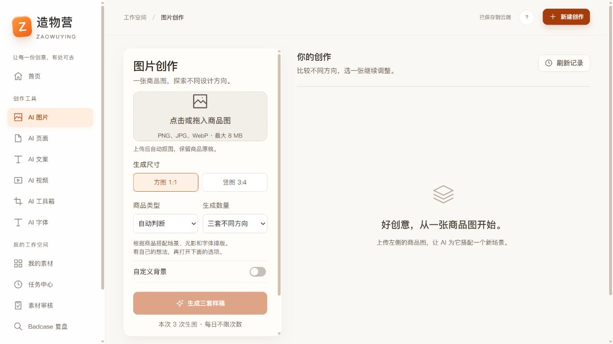
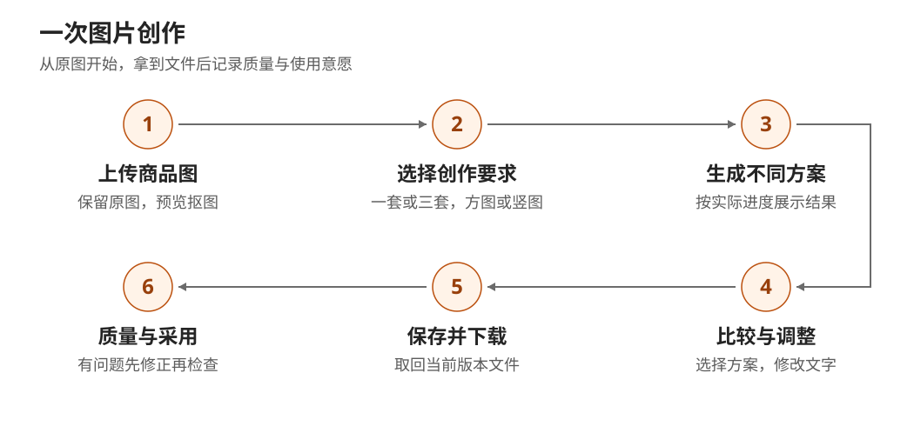
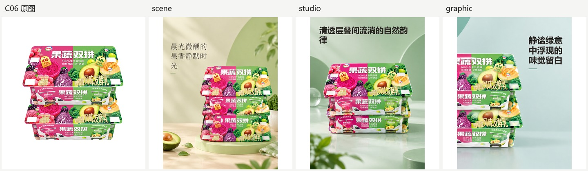

# 造物营 PRD｜精简图文评审版

版本：V1.1｜日期：2026-10-02｜状态：待评审

这份文档用于评审造物营的图片创作版本：先明确用户要完成什么，再讨论功能、质量和上线条件。当前核心创作流程已经实现，真实生成已跑通，图片质量修复与人工验收仍待完成。

## 产品要解决的问题

造物营帮助中小商家、店铺运营和电商设计师，把现有商品图做成适合新品上架、日常内容和活动宣传的创意图片。

一个典型场景是：商家准备宣传一款鲜奶，已有商品白底图，希望得到几种不同的画面，选一张改好标题后下载使用。现在这类工作往往需要分别抠图、找背景、写文案和排版，商品失真或文字不好读时还要返工。

产品希望把这些步骤连接起来，让用户**用一张商品图开始，比较方案、少量修改，再拿到实际可用的文件**。减少工时是需要验证的价值假设，目前还没有足够的真实用户采用与工时数据证明节省了多少。

本版是否成功，主要看三件事：商品和用户要求有没有被保留；文件能否真正拿到并打开；用户是否愿意直接使用或少量修改后使用。

## 本版范围与用户流程

### 这次重点做什么

本次评审聚焦电脑网页端的图片创作：上传商品图，生成一套或三套方案，查看和修改文字，保存、下载，以及记录质量反馈。智能抠图、商品场景图、标题文案和尺寸适配是已有辅助入口，质量仍需分别验证。

商品笔记、商详长图、导购文案、视频和创意字等入口，目前主要是需求保存与示意，完整生成放到后续版本。批量商品、自动发布和多人审批也不纳入本次验收。

### 用户怎么完成一次创作

图1：现有工作台界面，截图日期为2026-09-30。左侧上传和设置，右侧查看结果；次数提示以账户实际配置为准。

用户先上传商品图。系统保留原图，并提供抠图后的预览；效果不理想时可以重试或使用原图。随后选择方图或竖图，决定先生成一套，还是比较三套方向。有明确想法的用户，可以补充背景、标题和布局要求。

点击生成后，页面显示实际进度。完成的图片按方案展示；如果只完成一部分，要清楚说明已有几张、哪一套失败。用户选择方案后，可修改文字、保存新版本并下载。使用意愿和质量问题分别记录，供后续改进。

图2：图片创作主流程。质量不符合要求时先记录问题，修正后重新检查；不能直接把生成完成当作验收通过。

### 实际生成出来是什么样

图3：本批鲜奶样例。从左至右为原图、生活场景、棚拍和平面设计。三套图片是分别生成的真实结果，展示了背景、构图和文字层级的差异；尚未完成人工采用验收。

## 关键功能与使用规则

### 上传和设置要简单，默认就能开始

用户上传PNG、JPG或WebP图片，大小不超过8MB。缺图、图片损坏或超过限制时，页面直接说明原因，保留已填写的设置，不启动生成。

生成数量支持一套或三套，默认三套；画面支持1:1方图和3:4竖图，最终分别为1080×1080和1080×1440。品类和方向可以自动判断，也允许用户明确选择。背景描述最多500个字符，标题最多18个、副标题最多40个；超过限制要提示修改，不悄悄截断。

关闭自定义文案时，系统可以生成通用标题；开启后，应使用用户输入的文字。开启但没有填写文字，表示不要增加额外文字，商品包装上的原有字样可以保留。

### AI可以改变画面，但要守住商品和明确要求

- 商品的数量、主要形态、包装和可见标识应与原图一致，不能为了好看改成另一个商品。看不清的细节需要人工确认。
- 品牌、规格、价格、功效和促销等信息要有用户确认的依据，AI不能自行补出商业事实。
- 用户明确写出的要求要落实到成品。例如“禁止新增水果”，最终画面就不能再出现水果；提示词里写了这句话还不够。
- 三套方案至少在场景、构图、配色或文字层级中的两个方面有实质区别，不能只换文字或颜色交差。
- 方图和竖图都要保全商品主体，标题不能挡住关键包装；中文换行应自然，文字在所在区域要清楚可读。

这些是验收要求，其中商品裁切、像素层面的禁止元素、中文排版和局部文字对比度，当前已有未解决案例。

### 查看、修改和下载要交付实际文件

结果区域应展示真实加载出来的成品。用户只修改标题或副标题时，优先复用已有底图，保存为新版本，不再次调用图片生成。图片有变化后，原先的质量结论不能直接沿用。

下载后要能重新打开文件，尺寸和文字与选中的版本一致。点击下载按钮只代表请求，不能自动算作已拿到文件、已采用或已发布。

用户可以回到自己的项目继续编辑，删除的项目支持恢复。保存失败要保留草稿，同时编辑发生冲突时提示核对，不能直接覆盖另一份更新。用户只能查看和修改自己的项目与图片。

### 失败要说清楚，重试不能悄悄增加消耗

生成失败时保留已经成功的方案，说明失败发生在生成还是保存环节。连续点击同一次提交不应重复生成；额度不足或服务不可用时要直接提示。

如果图片已经生成，只是下载或保存失败，应先核对能否取回原结果。能恢复时只取回和补保存，不新增生成调用；需要重新生成时，应先说明范围和消耗，让用户选择。结果还不确定时，不自动再付费跑一次。

当前执行仍依赖浏览器连接，页面离开或断网可能中断。用户回来后应能核对任务和尝试恢复，不能承诺关闭页面后仍可靠地持续生成。

### 质量反馈要能回到具体图片

用户可以表达采用意愿，也可以记录商品、背景、文案或排版问题。正式质量评审需要对照原图和当前成品，确认商品正确、要求满足、文件可用，并记录视觉评分及修改时间。

内部评分沿用四项：构图、风格、光影和文字，每项0—2分。三个基本条件全部通过，四项各至少1分、合计至少6分，且不需要重做、修改不超过10分钟，才可判为合格；是否采用再由用户明确选择。简易“采用这组”反馈不能代替这份人工质量证据。

## 验收标准与当前结果

### 什么情况下可以通过评审后的功能验收

以下是需要实际验证的完成条件，当前尚未全部通过。

| 检查内容 | 通过条件 |
| --- | --- |
| 输入与文案 | 合法图片可开始；缺图、超限和超长文字不能触发生成；空文案选择被准确执行 |
| 商品与约束 | 商品主体完整、数量和包装可信，用户指定文字与禁止元素符合要求 |
| 方案差异与可读性 | 三套有至少两个实质差异；文字不遮挡关键信息，没有明显断行或对比度问题 |
| 文件与修改 | 请求数量全部保存并可打开才算完整交付；文字修改不新增生图调用；下载能得到当前版本 |
| 异常与项目保护 | 成功方案不丢失；重复点击不重复付费；恢复与重新生成区分；私有数据和并发保存受到保护 |
| 人工验收与问题修复 | 质量与采用有当前图片的人工记录；修复后用相同输入条件再次检查，并保留新结果与结论 |

### 已经验证到哪一步

2026-09-30这批本机评测执行了12个独立场景：10个生成场景、2个输入边界场景。10个生成场景中，9组完整、1组只完成部分，实际保存29张成品；完整交付率为90%。正向任务耗时中位数约103秒，样本只有10个，不能当成固定完成时长。

独立AI评分原始结果为12条中9条通过，但这次评分没有图片像素，只检查执行和文字等约束。两条事实扣分需要结合原图复核；图片评分高，也不能据此证明商品和画面合格。

截至2026-10-02记录核对，产品人工视觉评分仍为0/29，评分器正式人工复核为0/12，5条真实问题仍在调查，修复后重新验证的记录为0。因此，实际采用率、商用可用率、真实单次采用成本仍未测。

### 为什么现在还需要修复

图4：本批果蔬双拼样例。第二张场景图新增了用户禁止的牛油果，最右侧平面图裁掉了左侧商品。这个用例的非视觉评分为100分，仍不能通过视觉验收。

接下来先修商品裁切和违反明确要求的情况，再处理中文断行、标题在明亮背景上不易看清，以及某个方向生成失败的问题。裁切和排版优先利用已有底图修改，减少额外生成。修改后需检查新版本，不能只写“已修复”就关闭问题。

## 评审决策与后续安排

### 这次评审建议确认三件事

**范围与优先级。** 建议先完成图片创作闭环，把商品正确、明确要求、实际文件和人工验收放在前面；图文和视频等扩展在此之后推进。

**试用方式与消耗。** [待确认] 建议先内部小范围试用，明确可用次数、预算和负责核账的人，不自动增加付费重试。首次可用率、真实修改时间和采用成本用于判断效果，具体试用目标由项目负责人在启动前确认，不把历史演算值当实测。

**资料保留与使用范围。** [待确认] 建议试用期间保留原图、成品和评审证据，项目删除先支持恢复；正式清理前明确备份与保留周期。本版按单账户使用，团队协作与审批另行设计。

项目负责人组织产品、设计、研发和测试完成上述决策；再依次修复5条问题、评审29张图片、复核12条AI评分，补做实际下载、失败恢复、重复提交和采用统计检查。需要重新生成的修复先确认预算。扩大试用前，再补不同品类、真实用户工时和账单验证。

如果用于课程提交，可附本批真实结果和问题归因。课程要求为执行项目评测及问题归因复盘；产品是否已验收要按本稿的实际记录说明。

详细规则与技术验收可查阅[完整PRD](https://my.feishu.cn/docx/PJe2dvUFBoZDwgxItzicypzWnef)；需要逐项决策时查阅[待确认清单](https://my.feishu.cn/docx/DIUfd394noTTDIxLDJrcGSMxnFe)。本稿基于完整PRD当前修订、本机真实评测和2026-10-02只读核对整理，配图使用已有界面与真实生成证据。
