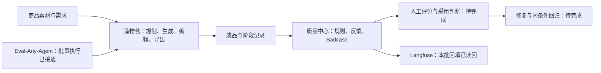

# 造物营项目总览与进度盘点

2026-10-01 当前交付：[飞书PRD完整评审版（Skill标准版）](https://my.feishu.cn/docx/PJe2dvUFBoZDwgxItzicypzWnef)与[独立待确认清单](https://my.feishu.cn/docx/DIUfd394noTTDIxLDJrcGSMxnFe)已按pm-master、pm-prd-writer重建并读回验证；另有[本地Markdown备份](E:/...AAAAIIIIIAIPM/个人项目/交付文档/造物营_PRD_Skill标准版_V1.0.md)。正文五章、12条AI规则、32条验收用例、4张流程画板及3张真实问题图片。本次完成文档交付，没有新增人工评分、付费生成或修复回归；下方保留9月30日产品盘点。

更新：2026-09-30 19:00，北京时间。整体工程与部署快照为 18:39；19:00 补充复核新非视觉评分和两份飞书文档。范围包括“个人项目”各有效目录、主产品源码、本机运行数据和线上部署；保留旧评测材料作为历史协议。

2026-09-30 工具补充：Eval-Any-Agent 的结果页已增加 **人工复核**，可对照图片证据保存判断、理由和修改历史，支持筛选与 CSV/XLSX 导出；原始 AI 结果保留。正式结果仍为 12 条待复核、0 条已复核，产品视觉采用仍为 0/29。[操作说明](E:/...AAAAIIIIIAIPM/个人项目/Eval-Any-Agent-source-20260929/Eval-Any-Agent/人工复核使用说明.md)。

**当前阶段：核心产品已发布，首轮真实链路基线已执行，正在等待质量修复、人工验收和改进回归。** 本机真实评测已有 12 个场景、29 张成品和 5 条问题；商用可用率与采用率仍未测。完整商业创意平台还有 7 个工具入口处于框架阶段。

## 1. 相比上次盘点，实际推进了什么

| 项目 | 17:49 盘点 | 本次复核 |
| --- | --- | --- |
| 当前批次真实模型评测 | 尚无已执行批次证据 | 12/12 个独立场景执行完毕；10 个生图、2 个边界校验 |
| 正向交付 | 未形成批次结果 | 9/10 组完整交付，1/10 组部分交付；保存 29 张成品 |
| 真实 Badcase | 新质量体系尚无记录 | 本机 5 条，均为 investigating；尚无修复回归或关闭 |
| 人工验收 | 未完成 | 仍为 0；新增的是 AI 视觉预审，不是人工采用判断 |
| 本机评测工具 | 1 个 MOCK 数据集，无执行配置 | 3 个数据集、2 个映射、2 个已完成执行任务；新增 1 个非视觉评分器，12 条判分完成 |
| Langfuse 真实产品记录 | 仅接入测试完成 | 10 条评测 trace 已留存读回证据，本次独立抽查 C02/C06 成功；运行中产品接口仍显示未配置自动导出 |
| 产品代码与发布 | V14；88 项测试通过 | 提交与发布未变，仍为 V14；本次未重复运行相同测试 |

这次主要新增了实测、独立评分和问题证据，尚无质量修复完成的证据。新非视觉评分原始通过 9/12，其中 C08/C09 的事实依据判定与原图标签不一致，需复核；C06 的非视觉 100 分不关闭已有视觉问题。详见 [评分复核](E:/...AAAAIIIIIAIPM/个人项目/outputs/real-eval-20260930/新评估结果复核_非视觉v1.md) 和 [PRD 与作业差距清单](E:/...AAAAIIIIIAIPM/个人项目/PRD与作业交付差距清单.md)。下一轮重点为评分复核、人工判断与真实修复回归。

## 2. 项目整体结构与范围

造物营面向电商设计师、商家与运营，提供 PC 端商品创意工作台。当前核心用户任务是：上传商品，生成三个有差异的方向，选择、修改并导出。页面、导购文案、视频和创意字属于完整平台扩展。手机端、证件照和 AI 图标已从确认范围移除，不计入待办。

| 部分 | 职责与当前位置 |
| --- | --- |
| 主产品源码 | [material-studio](C:/Users/22831/Documents/Codex/2026-09-19/tu/material-studio)，位于 C 盘，持续开发应使用此目录 |
| 线上产品 | [造物营](https://material-studio-demo.changfangzhen4.chatgpt.site)，V14 已发布 |
| 原始素材 | [素材](E:/...AAAAIIIIIAIPM/个人项目/素材)，70 张图片、1 个 PSD |
| 研究与早期视觉样稿 | [output](E:/...AAAAIIIIIAIPM/个人项目/output)，品类研究、概念图、场景融合样例、部署包 |
| 原评测材料 | [原评测交付目录](E:/...AAAAIIIIIAIPM/个人项目/outputs/01a0ede6-c7e3-7563-9c6c-d453396ca4bd)，20 条视觉/工程用例、20 条 MOCK、A/B 模板 |
| 最新真实评测 | [real-eval-20260930](E:/...AAAAIIIIIAIPM/个人项目/outputs/real-eval-20260930)，12 场景输入、结果、成品、问题和追踪证据 |
| 评测执行工具 | [Eval-Any-Agent](E:/...AAAAIIIIIAIPM/个人项目/Eval-Any-Agent-source-20260929/Eval-Any-Agent)，本机运行副本 |
| 文档制作记录 | [draft_b54b6272_folder](E:/...AAAAIIIIIAIPM/个人项目/draft_b54b6272_folder)，飞书文档 XML、回读与提交档案 |
| 技术过程与复核 | [.work](E:/...AAAAIIIIIAIPM/个人项目/.work)，接入、评测脚本和审计快照 |

本文件夹内的两个 TAR 是编译后的 Worker 与部署配置，不是完整源码备份。保留现有目录与运行路径，通过 [README](E:/...AAAAIIIIIAIPM/个人项目/README.md) 统一定位。

## 3. 完成度：按可核查的分母判断

| 验收范围 | 当前结果 | 可以得出的结论 |
| --- | --- | --- |
| 平台工具入口 | 5/12 在代码中标记可用 | 入口覆盖约 42%；不是工程总完成度，多个入口复用同一流程 |
| 当前发布 | V14 成功；源码提交 `487a7006e357277fc08e345c4dcbf77cd6955011` | 当前代码已发布；质量缺陷尚无新修复版本 |
| 自动化测试 | 上轮在相同提交运行 88/88 通过 | 既有测试通过；不能代表模型效果或本次人工验收通过 |
| 最新批次执行 | 12/12 场景 | 本批执行已完成，不等于原两套各 20 条协议全部完成 |
| 正向完整交付 | 9/10 组；29/30 张候选保存 | 完整交付率 90%；部分交付 1 组 |
| 边界校验 | 2/2 通过 | 缺图与标题长度保存边界得到验证 |
| 确定性规则合同 | 11/12 场景通过 | 文件、数量、尺寸等已执行规则的结果；不证明包装准确、审美或商用可用 |
| 人工评分与采用判断 | 0/29 张成品 | 尚无可报告的采用率或商用可用率 |
| 非视觉模型评分 | 12/12 判分完成；原始 9/12 通过，均分 95.58 | 执行与文本约束评分，不代表图像质量；C08/C09 疑似误判待复核 |
| 真实问题闭环 | 5 条已记录；0 条回归、0 条关闭 | 问题发现完成，修复验收未完成 |
| A/B 对比 | 已有版本 A 基线；无版本 B 回归 | 尚不能报告优化收益 |
| Langfuse 本批回填 | 10 个生成任务、157 个 observation、67 个 score | 本批历史过程已同步并留存读回；自动导出运行配置仍待处理 |

本批采用每个正向场景 3 个候选。旧模板约定 2 个候选，其 40 个 A/B 运行位和 64 个评分位仍未填写。不能把旧模板的“未执行”继续当作整个项目的最新状态，也不能直接比较不同候选数下的采用机会或成本。

## 4. 各工作流当前进度

| 工作流 | 已有证据 | 尚未完成 | 阶段 |
| --- | --- | --- | --- |
| 定位与范围 | PC、六类工具、12 个入口、图片优先 | 将本轮验收范围同步到旧产品说明与飞书文档 | 基本明确 |
| 上传、抠图与预处理 | 当前产品模块被本批真实执行使用，输入有哈希与预处理文件 | 透明包装、多主体边缘、更多品类逐图验收 | 已实现，覆盖有限 |
| 三方向图片创作 | 10 个正向场景实际调用；9 组交付齐全 | 包装精细核对、方向稳定性、自定义硬约束核验 | 基线完成，质量待修复 |
| 文案与版式 | 固定标题、无文案模式生效；图层合成有真实成品 | 行首标点、孤字、局部对比度、营销文案人工判断 | 已实现，有明确问题 |
| 保存与交付 | 29 张成品可读取，文件与记录哈希一致 | 商品安全适配、线上当前链路验收；交付后采用反馈 | 本机链路通过，效果待验收 |
| 质量中心 | 本机 29 条批次自动检查、4 条视觉问题反馈、5 条 Badcase | 人工评分、采用/拒绝、修复版本与回归记录 | 问题记录已形成 |
| 指标 | 逻辑任务、重试与环境区分已有代码；本批耗时可计算 | 采用率、返工时间、账单成本及业务收益 | 技术口径已具备，业务指标未测 |
| Langfuse | 本批回填 224 个导出项均为 sent；10 trace 留存读回，本次抽查 2 个 | 运行进程加载自动导出配置；线上 2 条 uncertain 核查 | 历史同步完成，自动链路未验收 |
| Eval-Any-Agent | 接口映射与批量采集接通；2 个执行任务及 1 个非视觉评分任务完成 | C08/C09 事实依据复核、视觉评分与人工采用 | 执行及非视觉评分完成，视觉验收未完成 |
| 品类研究 | 食品、数码、服装、家居的规则草案；代码已有类别路由 | 本批主要是食品饮料，数码/服装/家居需独立真实验证 | 规则已有，跨品类验收不足 |
| 页面、视频、创意字等 | 用途、参数、需求保存框架 | 真实生成、编辑与交付 | 框架阶段 |

可用标记的 5 项是图片创作、商品场景图、标题文案、尺寸适配、智能抠图。其余 7 项为商品笔记、商详长图、创意卡片、导购文案、图生视频、即刻成片、创意字。本批主要验证图片主流程，不代表 5 项均已分别完成完整验收。

## 5. 最新真实评测与 5 条问题

批次 `real-eval-20260930-v1`，版本 A，环境 `evaluation`，使用本机当前产品的真实模型接口。原 20 条 MOCK 策略样例去重并适配真实素材，形成 12 个独立场景；不属于线上用户或投放数据。

- 10 个正向场景各要求 3 张：9 组完整、1 组部分交付，共 29 张成品。
- 实际生图请求 30 次，有用量记录的视觉分析 10 次，自动付费重试 0 次。
- 正向端到端耗时 P50 为 102.8 秒，P95 为 188.3 秒，使用最近秩法；这是 10 条小样本的批次结果。
- 11 条 AI 视觉预审覆盖 10 个正向场景；人工逐图评分、采用率、商用可用率仍为空。
- 商品分析记录为 qwen3-vl-plus，生图模型以每条任务冻结字段为准；实际费用尚未用服务商账单核验。

完整逐例结果见 [真实评测报告](E:/...AAAAIIIIIAIPM/个人项目/outputs/real-eval-20260930/真实评测报告.md) 和 [真实结果 JSONL](E:/...AAAAIIIIIAIPM/个人项目/outputs/real-eval-20260930/真实评测结果.jsonl)。

| 优先级 | 已记录问题 | 证据与当前状态 | 下一步验收 |
| --- | --- | --- | --- |
| P0 | C06 / graphic 商品被裁切 | 请求竖图，返回横图；原图商品完整，最终竖版截断商品与包装字样。[成品](E:/...AAAAIIIIIAIPM/个人项目/outputs/real-eval-20260930/C06/graphic.png) 本次已查看 | 用同一原始返回图验证宽高比校验与主体安全适配；不必重新生图 |
| P0 | C06 / scene 违反背景禁用项 | “不新增商品或水果实体”已进入策略，成品仍新增牛油果；已记录视觉预审 | 明确硬约束优先级，增加结果检查；受控回归确认 |
| P1 | C02 / graphic 未交付 | 生图阶段 125.24 秒后 PROVIDER_UNAVAILABLE，3 个方向只有 2 张 | 对照供应商请求与账单；处理失败方向并记录恢复结果 |
| P1 | C05 中文断行，C09 复现 | 行首逗号、孤字；[C05 成品](E:/...AAAAIIIIIAIPM/个人项目/outputs/real-eval-20260930/C05/scene.png) 本次已查看 | 同底图、同文案验证中文禁则与孤字控制 |
| P1 | C03 / studio 局部文字对比不足 | 浅背景上的白字可读性弱；整块区域平均亮度不足以保证每行可读 | 同底图验证局部对比、字色与调位策略 |

5 条均为 `investigating`，没有关闭。其中 1 条来自服务端执行异常，4 条来自 AI 对真实成品的视觉预审；后 4 条仍需人工确认严重度与采用影响。

C06 裁切图仍通过了现有确定性合同，说明规则检查尚未覆盖主体完整性。数据库的任务 `succeeded` 或评测工具的“成功”也不能代替完整交付和质量验收。

覆盖边界：C08 实际采用饮品测试完整性，原 MOCK 的数码录音豆未覆盖；C09 未验证缺资料主动澄清；C10 核验 17 字可保存、20 字被拒绝，不是长标题成图换行测试。初始测试器错误预期已经校准，不计为产品缺陷。

## 6. 本机、线上与追踪数据分别到了哪里

### 本机产品与评测工具

| 数据位置 | 本次只读快照 |
| --- | --- |
| 产品任务与成品 | 12 条成功任务：10 条本批生图 + 2 条 legacy；31 张资产：29 张本批 + 2 张历史 |
| 产品质量检查 | 31 条均为自动检查；本批 29 条，人工检查 0 |
| 产品反馈与问题 | 4 条视觉问题反馈；5 条 investigating Badcase；回归 0 |
| 产品事件 | 276 条事件，其中本批 272 条、历史 4 条 |
| Langfuse 台账 | 224 条 sent：157 observation + 67 score |
| Eval-Any-Agent | Dataset 3、MappingProfile 2、LlmProviderConfig 2、EvalTask 2、EvalResult 24 |
| 独立评分（19:00 补查） | Evaluator 1、EvaluationTask 1 completed、EvaluationResult 12 success；原始 9 条 passed、3 条未通过 |

工具的 2 个执行任务分别是原始真实执行与标题校准后的证据汇总重放，每个 12 条。**24 条 EvalResult 对应 12 个独立场景，第二个任务没有新增付费调用。** 3 个数据集是原 20 条 MOCK、真实 12 条输入和校准汇总 12 条输入。

### 线上 V14

线上部署仍成功，发布时间为 2026-09-30 17:42 左右。云端 D1 仍是 8 条 legacy 任务：7 条图片、1 条文案，5 条成功、3 条失败。逐图反馈、质量检查、Badcase、回归表仍为空；一条旧文案有采用反馈。

因此，本批新增质量证据属于本机内部评测，尚未证明线上当前质量链路完整通过。不能将旧任务的 5/8 或本机的 9/10 当成线上采用率。

### Langfuse

最新归档已有全部 10 条生图任务的读回核验；本次独立通过只读 API 抽查 C02/C06，observation 和 score 均返回 HTTP 200，数量与归档一致，环境为 evaluation。记录是过程与规则/问题分数，没有人工设计评分。

但本机运行中的 `/api/status` 仍返回 `langfuse.configured=false`、`host=null`。已完成的是现有批次回填，后续任务自动导出仍待核验。进程可能尚未加载最新配置，具体原因需要检查运行配置，不能仅凭配置文件或历史 sent 状态认定自动链路已启用。

线上另有 2 条 legacy span 为 uncertain，错误码 TRANSPORT_OUTCOME_UNKNOWN，仍需按原有 ID 查回。不能为核查追踪而重复生图。

## 7. 旧材料与当前成果如何对应

| 材料 | 保留用途 | 当前状态与处理 |
| --- | --- | --- |
| [评测集_v0.1.jsonl](E:/...AAAAIIIIIAIPM/个人项目/outputs/01a0ede6-c7e3-7563-9c6c-d453396ca4bd/评测集_v0.1.jsonl) | 原 16 条视觉 + 4 条工程验收 | 文件仍为 20 条 not_run；最新 12 场景不是此原清单的完整执行 |
| [MOCK 工作簿](E:/...AAAAIIIIIAIPM/个人项目/outputs/01a0ede6-c7e3-7563-9c6c-d453396ca4bd/mock-dataset/造物营_MOCK评测数据集_20条.xlsx) | 策略结构与预期分支 | 原 20 条仍标模拟/未执行；真实适配映射见最新报告 |
| [指标与 Badcase 工作簿](E:/...AAAAIIIIIAIPM/个人项目/outputs/01a0ede6-c7e3-7563-9c6c-d453396ca4bd/造物营_指标埋点评测与Badcase.xlsx) | 原两候选 A/B 协议模板 | 40 运行位、64 评分位仍未填写；尚未回写最新结果 |
| [18 小时执行方案](E:/...AAAAIIIIIAIPM/个人项目/outputs/01a0ede6-c7e3-7563-9c6c-d453396ca4bd/18小时执行方案.md) | 历史方法与评分标准 | 新代码已实现多项原待办；新版三候选基线已执行，人工验收与 B 回归仍未完成 |
| 主源码 README、PRODUCT、docs/PROGRESS | 产品与工程说明 | 部分仍写旧接口、两版式、29 项测试；需要同步当前流程与实测阶段 |
| 早期概念图与研究 | 品类方向参考 | image_gen 概念图有包装重绘，不能混入本批产品交付指标 |
| 飞书文档与本地快照 | 产品正文、指标与历史文档制作 | 19:00 只读核对主文档 revision 312、指标文档 revision 25；主文档未并入评测/指标，指标文档仍写基线待执行；需同步新批次，未修改远端 |

旧模板不覆盖最新成果是文档维护缺口。可以补充“批次、版本、候选数、输入映射、实际结果”的索引，保留旧协议，避免覆盖历史记录或混用分母。

## 8. 下一轮最应完成的工作

| 优先级 | 工作 | 验收证据 |
| --- | --- | --- |
| P0 | 修复商品裁切与宽高比适配 | C06 同原始图的前后成品，商品完整且画幅正确；自动规则能识别原缺陷 |
| P0 | 完成 29 张人工评审与逐组采用判断 | 对照原图的包装/数量/规格评分；每图采用或拒绝理由；报告明确有效分母 |
| P0 | 验证背景禁用项及修复策略 | C06 原需求、改动版本、受控结果；禁止水果实体得到人工确认 |
| P1 | 修复断行、孤字与局部对比 | C03/C05/C09 同底图回归，保留输入、前后结果与人工可读性判断 |
| P1 | 处理 C02 上游失败 | 原始错误与请求 ID、供应商核查、失败方向恢复结果；不重复成功方向 |
| P1 | 完成至少一条版本 B 问题回归 | Badcase 关联修改提交、同输入与同条件结果，人工确认后才关闭 |
| P1 | 核验自动 Langfuse 配置及线上质量链路 | 运行进程配置生效；一条授权真实任务的过程与反馈按 ID 读回；旧 uncertain 单独处理 |
| P1 | 复核非视觉评分、补视觉验收 | C08/C09 原图事实与评分争议关联；自动规则、模型评分、人工评分分开 |
| P2 | 更新模板与产品文档 | 主 PRD 接入评测与指标；旧 20 条与新 12 条覆盖映射明确 |
| P2 | 扩展真实品类与其余工具 | 先补数码、服装、家居的独立素材与验收，再安排页面、视频等功能 |

排版和裁切可先复用已保存底图验证，避免因重生成改变变量。新的模型回归应按授权预算与相同实验条件执行。实际费用、单位采用成本和业务收益待账单及人工采用结果形成后计算。

## 9. 文件夹规模与最新阅读入口

统计排除了 node_modules、.git、.next、dist、build、虚拟环境与缓存；为本次 18:36 左右的文件快照，后续写入可能改变数量。

| 目录 | 有效文件 | 当前角色 |
| --- | --- | --- |
| 素材 | 71，约 27.16 MB | 原始商品与参考素材 |
| output | 14，约 24.75 MB | 研究、样稿、场景融合产物与历史部署包 |
| outputs | 178，约 114.58 MB | 原评测交付 + 新增真实批次；新批次约 171 个文件 |
| Eval-Any-Agent-source-20260929 | 129，约 3.43 MB | 工具源码、本机数据库与配置 |
| draft_b54b6272_folder | 56，约 1.85 MB | 飞书文档制作档案 |
| .work | 52，约 3.03 MB，不含项目审计目录 | 接入、执行和检查过程 |

建议从以下入口阅读：

- [最新真实评测报告](E:/...AAAAIIIIIAIPM/个人项目/outputs/real-eval-20260930/真实评测报告.md)：逐场景结果、问题证据与覆盖边界。
- [真实评测看板](E:/...AAAAIIIIIAIPM/个人项目/outputs/real-eval-20260930/真实评测看板.html)：查看成品与问题；[本机预览](http://127.0.0.1:4174/)。
- [评测工具最新汇总任务](http://127.0.0.1:3000/dashboard/tasks/cmuny0px80013bxi8791t27qt/results)：校准后的真实证据汇总，不是第二批模型生成。
- [本机产品质量中心](http://127.0.0.1:4173/#quality)：选择“内部评测”查看本批，和线上质量库分开。
- [素材取样清单](E:/...AAAAIIIIIAIPM/个人项目/outputs/01a0ede6-c7e3-7563-9c6c-d453396ca4bd/素材取样清单.md)：原 16 张取样与哈希。
- [品类视觉规则](E:/...AAAAIIIIIAIPM/个人项目/output/research/category-generation-20260930/造物营-品类视觉生成逻辑-v0.1.md)：研究与类别方向。
- [Langfuse 接入说明](E:/...AAAAIIIIIAIPM/个人项目/.work/langfuse-integration/INTEGRATION.md)：过程字段、幂等与验收方法。
- [评测工具部署说明](E:/...AAAAIIIIIAIPM/个人项目/Eval-Any-Agent-source-20260929/Eval-Any-Agent/本机部署.md)：访问、启动与停止。
- [飞书指标与评测文档](https://my.feishu.cn/docx/QVBndk9egoGTKZx9WGJcIb2bnic)：最新读回 revision 25，执行状态仍需同步。
- [主产品文档](https://my.feishu.cn/docx/Yi22dTgF7oTrf8xKh4hcHuWXnNb)：最新读回 revision 312，评测与指标仍在独立材料中。
- [新评分复核](E:/...AAAAIIIIIAIPM/个人项目/outputs/real-eval-20260930/新评估结果复核_非视觉v1.md) 与 [PRD/作业差距清单](E:/...AAAAIIIIIAIPM/个人项目/PRD与作业交付差距清单.md)。

## 10. 本次独立复核依据

本次重读当前代码状态、两份原 XLSX、JSONL、最新批次输入与结果、数据库和发布状态；独立检查 12 个用例唯一性、模型请求、业务交付与耗时，校验全部 29 张成品及输入哈希，无文件缺失或哈希错误。

本机产品、评测工具与看板接口均 HTTP 200。Langfuse 本次抽查为只读，没有新增模型请求。主产品提交与上轮 88 项测试的提交一致，本次未重复运行测试。云端表与本机数据库分别取证。

- [独立复核记录](E:/...AAAAIIIIIAIPM/个人项目/.work/project-audit-20260930/recheck-1837/independent-verification.json)
- [文件、表格与本机数据库快照](E:/...AAAAIIIIIAIPM/个人项目/.work/project-audit-20260930/recheck-1837/inspection.json)
- [线上发布与数据快照](E:/...AAAAIIIIIAIPM/个人项目/.work/project-audit-20260930/recheck-1837/live-snapshot.json)
- [上轮 88 项测试输出](E:/...AAAAIIIIIAIPM/个人项目/.work/project-audit-20260930/product-tests.tap)
- [19:00 新评分与飞书文档复核](E:/...AAAAIIIIIAIPM/个人项目/.work/project-audit-20260930/prd-check-1900/grading-review-evidence.json)

本次仅更新根目录进度与入口文档、保存审计支持记录，没有修改产品代码、运行数据库、原评测表或既有目录；没有新增付费模型调用。
